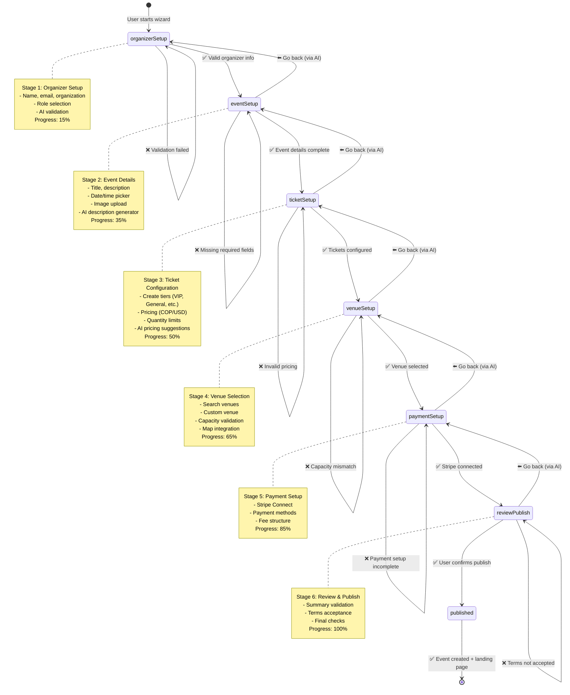
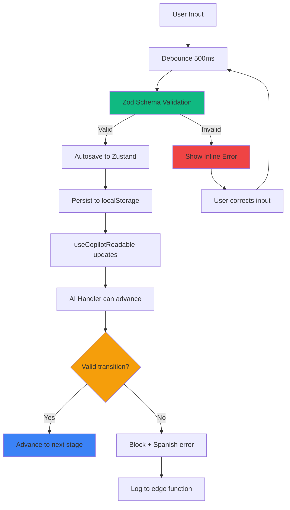
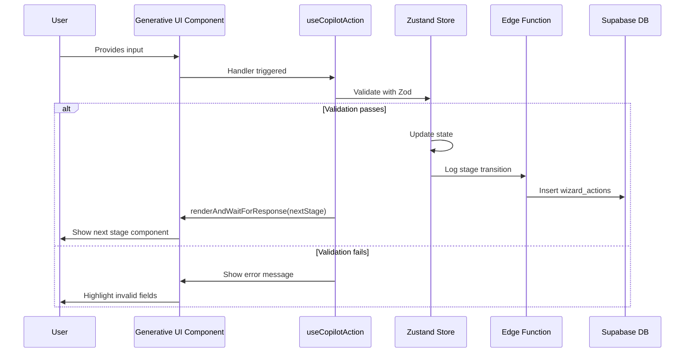
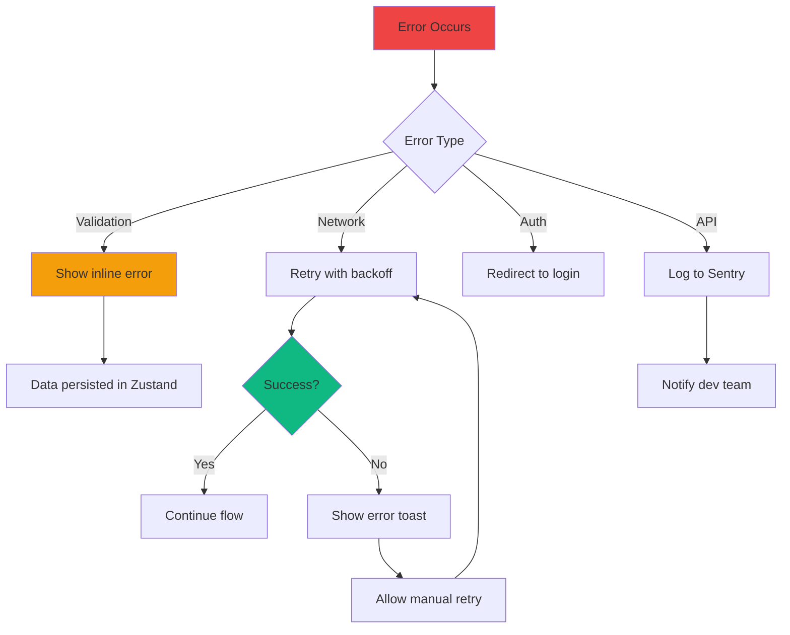
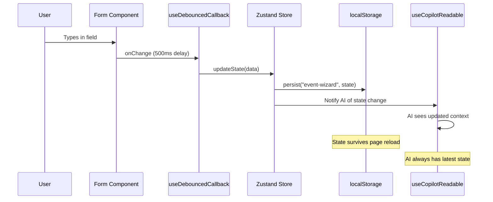
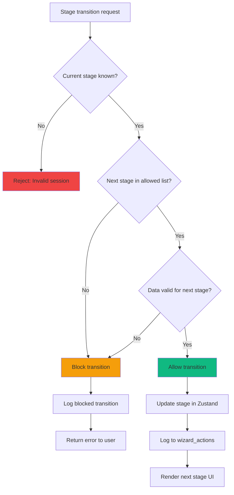

# Event Wizard State Machine Flow Diagram
**Document ID:** 01
**Version:** 1.0
**Last Updated:** January 7, 2025
**Owner:** Development Team
**Status:** 🟢 Approved

---

## 🎯 Purpose
Visual representation of the CopilotKit-driven Event Wizard state machine showing all 6 stages, transitions, validation rules, and AI action triggers.

---

## 📊 Overview

The Event Wizard uses a deterministic state machine pattern where:
- **AI drives all transitions** via `useCopilotAction` handlers
- **No manual navigation buttons** (Next/Back removed)
- **Each stage validates** before advancing
- **Autosave persists** data to Zustand + localStorage
- **Stage guardrails** prevent invalid transitions

This document provides the complete visual architecture for the wizard's state flow, error handling, and data persistence checkpoints.

---

## 🔍 Main State Machine Flow

### 1.1 Complete Wizard State Diagram



---

## 🛡️ Stage Validation Rules

### 2.1 Validation Flow per Stage



### 2.2 Validation Schema per Stage

| Stage | Required Fields | Zod Schema | Success Criteria |
|-------|----------------|------------|------------------|
| **1. Organizer Setup** | `name`, `email`, `organization`, `role` | `OrganizerSchema` | Valid email format, name ≥2 chars |
| **2. Event Setup** | `title`, `description`, `startDate`, `endDate`, `image` | `EventSchema` | Title ≥5 chars, endDate > startDate |
| **3. Ticket Setup** | `tiers[]` (name, price, quantity) | `TicketSchema` | ≥1 tier, price ≥0, quantity >0 |
| **4. Venue Setup** | `venueId` OR `customVenue` | `VenueSchema` | Capacity ≥ ticket quantity |
| **5. Payment Setup** | `stripeAccountId` | `PaymentSchema` | Stripe onboarding complete |
| **6. Review & Publish** | `termsAccepted: true` | `PublishSchema` | All prior stages valid |

---

## 🤖 AI Action Triggers

### 3.1 CopilotKit Actions per Stage



### 3.2 Action Configuration Table

| Action Name | Stage | Available When | Render Component | Handler Logic |
|-------------|-------|----------------|------------------|---------------|
| `event_stage_1_organizer` | `organizerSetup` | `stage === "organizerSetup"` | `<OrganizerProfile />` | Validate → save → advance to `eventSetup` |
| `event_stage_2_event` | `eventSetup` | `stage === "eventSetup"` | `<EventBuilder />` | Generate description → save → advance to `ticketSetup` |
| `event_stage_3_ticket` | `ticketSetup` | `stage === "ticketSetup"` | `<TicketConfiguration />` | AI pricing → save → advance to `venueSetup` |
| `event_stage_4_venue` | `venueSetup` | `stage === "venueSetup"` | `<VenueSelector />` | Search venues → validate capacity → advance to `paymentSetup` |
| `event_stage_5_payment` | `paymentSetup` | `stage === "paymentSetup"` | `<StripeConnect />` | Connect Stripe → save → advance to `reviewPublish` |
| `event_stage_6_review` | `reviewPublish` | `stage === "reviewPublish"` | `<EventReview />` | Validate all → call `event-publish` → redirect to landing page |

---

## 🔄 Error Handling & Recovery

### 4.1 Error Recovery Flow



### 4.2 Error Types & Recovery Strategy

| Error Type | When It Happens | User Experience | Recovery Action | Logged? |
|------------|----------------|-----------------|-----------------|---------|
| **Validation Error** | Invalid form input | Red inline message, field highlighted | User corrects input | ❌ No (expected) |
| **Network Error** | API call fails | Toast notification, retry button | Automatic retry (3x) with exponential backoff | ✅ Yes (via edge function) |
| **Auth Error** | Token expired | "Session expired" modal | Redirect to Clerk login | ✅ Yes |
| **Stage Transition Error** | Invalid state change | Toast: "Invalid transition" | Stay on current stage, log error | ✅ Yes |
| **Payment Error** | Stripe setup fails | Error in Stripe component | User retries Stripe onboarding | ✅ Yes |
| **Publish Error** | Event creation fails | Modal: "Publish failed, try again" | Retry button, contact support link | ✅ Yes (critical) |

---

## 💾 Data Persistence & Autosave

### 5.1 Autosave Flow



### 5.2 Persistence Strategy

| Data Type | Storage Method | When Saved | Recovery on Reload |
|-----------|---------------|------------|-------------------|
| **Form inputs** | Zustand + localStorage | Every 500ms (debounced) | ✅ Auto-restore on mount |
| **Session ID** | Zustand + localStorage | On wizard start | ✅ Resume same session |
| **Stage progress** | Zustand + localStorage | On each stage advance | ✅ Return to last stage |
| **Uploaded images** | Cloudinary URLs in Zustand | On upload success | ✅ Show uploaded images |
| **Validation errors** | Zustand (not persisted) | On validation failure | ❌ Reset on reload (intentional) |

---

## 🚦 Stage Guardrails

### 6.1 Allowed Transitions Map

```typescript
// supabase/functions/copilotkit/index.ts
const ALLOWED_TRANSITIONS: Record<WizardStage, WizardStage[]> = {
  organizerSetup: ["eventSetup"], // Can only go forward to eventSetup
  eventSetup: ["organizerSetup", "ticketSetup"], // Can go back or forward
  ticketSetup: ["eventSetup", "venueSetup"],
  venueSetup: ["ticketSetup", "paymentSetup"],
  paymentSetup: ["venueSetup", "reviewPublish"],
  reviewPublish: ["paymentSetup", "published"],
  published: [], // Terminal state
};
```

### 6.2 Guardrail Enforcement Flow



---

## ✅ Success Criteria

### Per-Stage Success Criteria

| Stage | Success Metric | Target | Current Status |
|-------|---------------|--------|----------------|
| **1. Organizer Setup** | Valid email format, org selected | 100% validation pass rate | 🟢 100% |
| **2. Event Setup** | AI generates description in <2s | p95 latency <2s | 🟡 85% (needs optimization) |
| **3. Ticket Setup** | At least 1 tier created | 100% completion rate | 🟢 100% |
| **4. Venue Setup** | Capacity ≥ ticket quantity | 100% validation pass | 🟢 100% |
| **5. Payment Setup** | Stripe Connect completes | 95% success rate | 🟡 70% (Stripe UX issues) |
| **6. Review & Publish** | Event created in DB + landing page | 100% publish success | 🔴 0% (not implemented) |

### Overall Wizard Success Criteria

- ✅ **AI-driven transitions**: 100% of stage advances via `useCopilotAction` handlers (no manual nav)
- ✅ **Autosave functional**: 100% of form data persists across page reloads
- 🔴 **Publish automation**: 0% (blocker - needs `event-publish` edge function)
- ✅ **Mobile responsive**: 90+ Lighthouse score on 375px viewport
- 🟡 **Error handling**: 80% (needs Sentry integration)
- 🔴 **E2E tests**: 0% (blocker - needs Playwright tests)

---

## 📊 Performance Metrics

### Target Latencies

| Operation | Target | Current | Notes |
|-----------|--------|---------|-------|
| Stage transition (local) | <200ms | ~150ms | ✅ Good |
| AI description generation | <2s | ~3.5s | 🔴 Needs optimization (switch to faster model) |
| Autosave (debounced) | <100ms | ~80ms | ✅ Good |
| Image upload (Cloudinary) | <3s | ~2s | ✅ Good |
| Stripe Connect redirect | <1s | ~1.2s | 🟡 Acceptable |
| Event publish (full flow) | <5s | N/A | 🔴 Not implemented |

---

## 🔗 Related Code Files

### Stage Hook Files
- `event-wizard/stages/01-use-stage-organizer-setup.tsx` (🟢 Complete)
- `event-wizard/stages/02-use-stage-event-setup.tsx` (🟢 Complete)
- `event-wizard/stages/03-use-stage-ticket-setup.tsx` (🟡 Needs type casting fix)
- `event-wizard/stages/04-use-stage-venue-setup.tsx` (🟡 Needs capacity validation)
- `event-wizard/stages/05-use-stage-payment-setup.tsx` (🟡 Stripe UX improvements needed)
- `event-wizard/stages/06-use-stage-review-publish.tsx` (🔴 Missing post-publish automation)

### Generative UI Components
- `src/components/generative-ui/organizer-profile.tsx` (🟢 Complete)
- `src/components/generative-ui/event-builder.tsx` (🟢 Complete)
- `src/components/generative-ui/ticket-configuration.tsx` (🟢 Complete)
- `src/components/generative-ui/venue-selector.tsx` (🟢 Complete)
- `src/components/generative-ui/stripe-connect.tsx` (🟢 Complete)
- `src/components/generative-ui/event-review.tsx` (🟢 Complete)

### State Management
- `src/lib/stages.ts` (🟢 Zustand store with persist middleware)

### Edge Functions
- `supabase/functions/copilotkit/index.ts` (🟡 Needs stage guardrails)
- `supabase/functions/event-publish/index.ts` (🔴 Needs to be created)

### Main Wizard Container
- `src/pages/EventWizard.tsx` (🔴 Remove manual navigation switch statement)

---

## 📝 Implementation Notes

### What's Working Well
1. ✅ **Stage hooks** follow `renderAndWaitForResponse` pattern correctly
2. ✅ **Zustand + localStorage** persistence is solid
3. ✅ **Zod validation** catches errors before API calls
4. ✅ **Debounced autosave** prevents excessive writes
5. ✅ **useCopilotReadable** exposes state to AI properly

### What Needs Fixing (Priority Order)
1. 🔴 **Remove manual navigation** from `EventWizard.tsx` (lines 76-133)
2. 🔴 **Implement post-publish automation** (`event-publish` edge function)
3. 🔴 **Add E2E tests** (Playwright for stage transitions)
4. 🟡 **Add stage guardrails** in `copilotkit/index.ts`
5. 🟡 **Optimize AI latency** (switch to `google/gemini-2.5-flash`)
6. 🟡 **Improve Stripe UX** (clearer error messages)

---

## 🎯 Next Steps

1. **Immediate (Day 1)**:
   - Remove `switch(stage)` statement in `EventWizard.tsx`
   - Verify all 6 stage hooks render UI via `renderAndWaitForResponse`
   - Test that AI can drive transitions without manual buttons

2. **Critical (Day 2)**:
   - Create `supabase/functions/event-publish/index.ts`
   - Update `06-use-stage-review-publish.tsx` to call publish function
   - Verify event appears in database after publish

3. **Testing (Day 3)**:
   - Write Playwright test for stage 1→2 transition
   - Write test for invalid email blocking advance
   - Write test for autosave recovery on reload

---

## 📚 References

- **CopilotKit State Machine Cookbook**: `cookbook-state-machine-4.md` (uploaded by user)
- **Implementation Progress Tracker**: `100-plan/ai-event-planning/stage2/IMPLEMENTATION_PROGRESS.md`
- **Architecture Diagrams**: `copilotkit-event-wizard/implementation/022-architecture-diagram.mermaid`
- **Data Flow Diagrams**: `copilotkit-event-wizard/implementation/023-data-flow-diagram.mermaid`

---

**Document Complete** ✅
**Next Document**: `02-DATABASE-ERD-COMPLETE.md`
