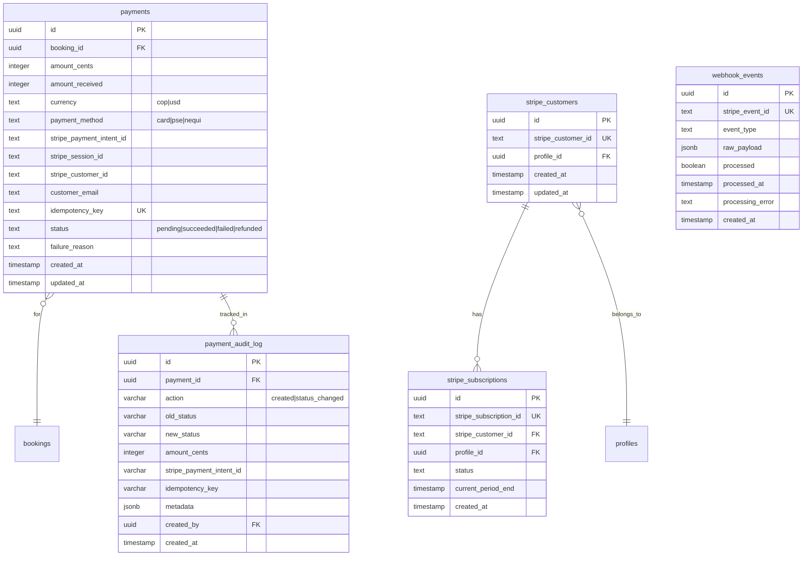

# Complete Database Entity Relationship Diagram
**Document ID:** 02
**Version:** 1.0
**Last Updated:** January 7, 2025
**Owner:** Database Team
**Status:** 🟢 Approved

---

## 🎯 Purpose
Complete Entity Relationship Diagram (ERD) showing all 32 tables, foreign key relationships, RLS policies, and data flow from Event Wizard to database.

---

## 📊 Overview

The Fashionistas database is built on **Supabase PostgreSQL** with:
- **32 tables** organized into 6 functional domains
- **Row-Level Security (RLS)** on all tables
- **Foreign key constraints** ensuring referential integrity
- **Audit logging** for critical tables (payments, events, bookings)
- **AI-specific tables** for machine learning features

This document provides the complete database schema with visual ERDs for each domain and a master ERD showing all relationships.

---

## 🏗️ Database Architecture Overview

### 1.1 Functional Domains

---

## 🗂️ Master ERD (All Tables)

### 2.1 Complete Schema Diagram

---

## 👤 Identity & Auth Domain

### 3.1 User Authentication & Profiles

### 3.2 RLS Policies (Identity Domain)

| Table | Policy Name | Operation | Logic |
|-------|------------|-----------|-------|
| `profiles` | `profiles_select_owner_or_admin` | SELECT | `clerk_id = auth.jwt()->>'sub' OR has_role('admin')` |
| `profiles` | `profiles_insert_own` | INSERT | `clerk_id = auth.jwt()->>'sub'` |
| `profiles` | `profiles_update_own` | UPDATE | `clerk_id = auth.jwt()->>'sub'` |
| `user_roles` | `user_roles_select_own` | SELECT | `profile_id = current_profile_id()` |
| `user_roles` | `user_roles_insert_admin` | INSERT | `has_role('admin')` |
| `organizations` | `organizations_public_read` | SELECT | `true` (public) |
| `notifications` | `notifications_select_own` | SELECT | `profile_id = user_profile_id()` |

---

## 🎭 Events & Ticketing Domain

### 4.1 Event Management Schema

### 4.2 Event Lifecycle Flow

### 4.3 RLS Policies (Events Domain)

| Table | Policy Name | Operation | Logic |
|-------|------------|-----------|-------|
| `events` | `events_public_read` | SELECT | `true` (all events visible) |
| `event_tickets` | `Anyone view tickets` | SELECT | `true` (public ticket info) |
| `bookings` | `bookings_select_owner_admin_organizer` | SELECT | `profile_id = current_profile_id() OR has_role('admin') OR event_id IN (SELECT id FROM events WHERE organizer_id = current_profile_id())` |
| `bookings` | `bookings_insert_own` | INSERT | `profile_id = current_profile_id()` |
| `booking_tickets` | `booking_tickets_select_owner_admin` | SELECT | `booking_id IN (SELECT id FROM bookings WHERE profile_id = current_profile_id()) OR has_role('admin')` |

---

## 💳 Payments Domain

### 5.1 Payment Processing Schema

### 5.2 Payment State Machine

### 5.3 RLS Policies (Payments Domain)

| Table | Policy Name | Operation | Logic |
|-------|------------|-----------|-------|
| `payments` | `payments_select_admin_or_owner` | SELECT | `has_role('admin') OR booking_id IN (SELECT id FROM bookings WHERE profile_id = current_profile_id())` |
| `payments` | `payments_no_insert` | INSERT | `false` (only service role) |
| `payments` | `payments_service_insert` | INSERT | `true` (service role) |
| `stripe_customers` | `stripe_customers_select_own` | SELECT | `profile_id = user_profile_id()` |
| `payment_audit_log` | `audit_log_select_own` | SELECT | `payment_id IN (SELECT id FROM payments WHERE booking_id IN (SELECT id FROM bookings WHERE profile_id = user_profile_id()))` |

---

## 🤖 AI Features Domain

### 6.1 AI Agent Schema

### 6.2 AI Agent Trigger Flow

```mermaid
sequenceDiagram
    participant User
    participant UI as Dashboard
    participant Edge as Edge Function
    participant AI as Lovable AI Gateway
    participant DB as Supabase DB

    User->>UI: Views event dashboard
    UI->>Edge: POST /health-score {event_id}
    Edge->>DB: SELECT event + bookings + models
    DB-->>Edge: Event data
    Edge->>AI: Analyze with Gemini 2.5 Flash
    AI-->>Edge: Health score + recommendations
    Edge->>DB: INSERT event_health_scores
    Edge->>DB: INSERT ai_agent_logs
    Edge-->>UI: Return score + UI
    UI->>User: Show health card with 🟢🟡🔴
```

### 6.3 RLS Policies (AI Domain)

| Table | Policy Name | Operation | Logic |
|-------|------------|-----------|-------|
| `event_health_scores` | `event_health_scores_select_organizer` | SELECT | `event_id IN (SELECT id FROM events WHERE organizer_id = current_profile_id())` |
| `event_health_scores` | `event_health_scores_select_admin` | SELECT | `has_role('admin')` |
| `model_castings` | `model_castings_select_organizer` | SELECT | `event_id IN (SELECT id FROM events WHERE organizer_id = current_profile_id())` |
| `runway_schedules` | `runway_schedules_insert_organizer` | INSERT | `event_id IN (SELECT id FROM events WHERE organizer_id = current_profile_id())` |
| `ai_agent_logs` | `ai_agent_logs_service_only` | ALL | `false` (service role only) |

---

## 📍 Venues & Assets Domain

### 7.1 Venue Management Schema

```mermaid
erDiagram
    venues ||--o{ events : hosts
    venues ||--o{ venue_bookings : has
    profiles ||--o{ assets : uploads
    
    venues {
        uuid id PK
        uuid organization_id FK
        text name
        text address
        text city
        text country
        integer capacity
        numeric hourly_rate
        jsonb amenities
        array images
        boolean is_active
        timestamp created_at
    }
    
    venue_bookings {
        uuid id PK
        uuid venue_id FK
        uuid event_id FK
        timestamp start_time
        timestamp end_time
        booking_status status
        integer total_cost
        timestamp created_at
    }
    
    assets {
        uuid id PK
        uuid profile_id FK
        text url "Cloudinary URL"
        text type "image|video|document"
        jsonb metadata
        timestamp created_at
    }
```

---

## 📊 Analytics & Marketing Domain

### 8.1 Dashboard Analytics Schema

### 8.2 Email Campaign Schema

---

## 🔒 Security & Audit

### 9.1 Audit Logging

### 9.2 Audit Triggers

| Table | Trigger Name | When Fires | What It Logs |
|-------|-------------|------------|--------------|
| `events` | `audit_trigger_function()` | INSERT, UPDATE, DELETE | Full old/new row data |
| `bookings` | `audit_trigger_function()` | INSERT, UPDATE, DELETE | Full old/new row data |
| `payments` | `trigger_payment_audit()` | INSERT, UPDATE (status change) | Status transitions, amounts |

---

## ✅ Data Integrity Checks

### 10.1 Foreign Key Constraints

| Child Table | Column | Parent Table | On Delete |
|------------|--------|--------------|-----------|
| `events` | `organizer_id` | `profiles.id` | CASCADE |
| `events` | `organization_id` | `organizations.id` | CASCADE |
| `bookings` | `event_id` | `events.id` | CASCADE |
| `bookings` | `profile_id` | `profiles.id` | CASCADE |
| `payments` | `booking_id` | `bookings.id` | CASCADE |
| `event_health_scores` | `event_id` | `events.id` | CASCADE |
| `model_castings` | `event_id` | `events.id` | CASCADE |

### 10.2 Unique Constraints

| Table | Columns | Purpose |
|-------|---------|---------|
| `profiles` | `clerk_id` | One profile per Clerk user |
| `profiles` | `user_id` | Legacy user ID uniqueness |
| `events` | `slug` | URL-friendly event identifier |
| `organizations` | `slug` | URL-friendly org identifier |
| `payments` | `idempotency_key` | Prevent duplicate payments |
| `stripe_customers` | `stripe_customer_id` | One Stripe customer per user |

---

## 🔗 Related Code Files

### Migration Files
- `supabase/migrations/` (all migration files)

### Database Types
- `src/integrations/supabase/types.ts` (auto-generated from schema)

### Edge Functions (Database Interactions)
- `supabase/functions/event-publish/index.ts` (🔴 To be created)
- `supabase/functions/health-score/index.ts` (🟢 Working)
- `supabase/functions/stripe-webhook/index.ts` (🟢 Working)

---

## 📝 Schema Evolution Notes

### Recent Changes
- ✅ Added `event_health_scores` table (Dec 2024)
- ✅ Added `ai_agent_logs` table (Dec 2024)
- ✅ Migrated from `auth.users` to `profiles` table (Nov 2024)
- ✅ Added `idempotency_key` to payments (Nov 2024)

### Pending Changes
- 🔴 Add `wizard_sessions` table for resume functionality
- 🔴 Add `event_collaborators` for multi-organizer support
- 🟡 Add `discount_codes` for promotional campaigns

---

**Document Complete** ✅
**Next Document**: `03-USER-JOURNEY-MARIA-ORGANIZER.md`
