# User Journey: Maria - Event Organizer
**Document ID:** 03
**Version:** 1.0
**Last Updated:** January 7, 2025
**Owner:** UX Team
**Status:** 🟢 Approved

---

## 🎯 Purpose
Complete user journey map for Maria Rodriguez, an event organizer creating "Bogotá Fashion Week 2025" using the AI-powered Event Wizard.

---

## 👤 Persona: Maria Rodriguez

**Role:** Fashion Event Organizer  
**Age:** 32  
**Location:** Bogotá, Colombia  
**Experience:** 5 years organizing fashion shows  
**Tech Comfort:** Moderate (uses Instagram, WhatsApp daily)  
**Primary Device:** iPhone 13 (mobile-first)  
**Language:** Spanish (native), English (business level)  

### Goals
- Create a professional fashion show event in <5 minutes
- Sell 300 tickets across 3 tiers (VIP, General, Student)
- Get AI help with model casting and vendor coordination
- Track ticket sales and event health in real-time

### Pain Points
- Previous platforms required 30+ minutes to set up an event
- No AI assistance for descriptions or pricing
- Manual model casting via email/WhatsApp is chaotic
- No insights into event performance until after the event

---

## 🗺️ Journey Map Overview

```mermaid
journey
    title Maria's Event Creation Journey (Target: <5 minutes)
    section Discovery
      Opens Fashionistas app: 5: Maria
      Sees "Create Event" CTA: 5: Maria
      Clicks "Start with AI": 5: Maria
    section Stage 1: Organizer Setup
      AI asks for name/email: 4: Maria, AI
      Fills form (1 minute): 4: Maria
      AI validates instantly: 5: AI
    section Stage 2: Event Details
      AI generates description: 5: Maria, AI
      Uploads event image: 4: Maria
      Sets date/time: 5: Maria
    section Stage 3: Tickets
      Creates VIP tier: 5: Maria
      AI suggests pricing: 5: Maria, AI
      Adds General + Student: 5: Maria
    section Stage 4: Venue
      Searches "Teatro Colón": 5: Maria
      AI checks capacity: 5: AI
      Confirms venue: 5: Maria
    section Stage 5: Payment
      Connects Stripe: 3: Maria
      Stripe redirect: 2: Maria
      Returns to wizard: 4: Maria
    section Stage 6: Review
      Reviews summary: 5: Maria
      Accepts terms: 5: Maria
      Clicks "Publish": 5: Maria
    section Post-Publish
      Sees event landing page: 5: Maria
      Gets WhatsApp confirmation: 5: Maria
      Views health score: 5: Maria, AI
```

---

## 📱 Step-by-Step Journey

### Step 1: Discovery & Entry (0:00 - 0:30)

**Screen:** Dashboard / Landing Page  
**Action:** Maria opens app, sees "Create Event with AI" button  
**Emotion:** 😃 Excited to try AI features

```mermaid
flowchart LR
    A[Opens app] --> B{Logged in?}
    B -->|No| C[Clerk login via Google]
    B -->|Yes| D[Sees dashboard]
    C --> D
    D --> E[Clicks "Create Event with AI"]
    E --> F[Wizard Stage 1 loads]
    
    style E fill:#10b981
    style F fill:#3b82f6
```

**UI Elements:**
- Hero CTA: "Create Your Fashion Event in 5 Minutes with AI"
- Stats: "500+ events created this month"
- Testimonial: "AI saved me 2 hours!" - Carmen, Organizer

**Success Criteria:**
- ✅ CTA click rate >30%
- ✅ Login conversion >80%
- ✅ Wizard load time <1s

---

### Step 2: Stage 1 - Organizer Setup (0:30 - 1:30)

**Screen:** Organizer Profile Component  
**Action:** AI asks Maria for basic info  
**Emotion:** 😊 Easy, familiar form


**Form Fields:**
- Name (required, min 2 chars)
- Email (required, validated format)
- Organization (dropdown: "Fashion Week Colombia")
- Role (dropdown: "Event Organizer")

**AI Assistance:**
- Auto-detects if email is from known organization
- Suggests organization based on email domain
- Validates role matches typical organizer profile

**Pain Point Addressed:**
- ✅ No need to re-enter info if user has profile
- ✅ AI pre-fills organization if it recognizes domain
- ✅ Autosave prevents data loss if Maria leaves

**Success Criteria:**
- ✅ Completion time <1 minute
- ✅ Validation error rate <5%
- ✅ Auto-advance without manual "Next" button

---

### Step 3: Stage 2 - Event Details (1:30 - 3:00)

**Screen:** Event Builder Component  
**Action:** Maria provides event basics, AI generates description  
**Emotion:** 🤩 Impressed by AI-generated description

```mermaid
flowchart TD
    A[AI asks for event title] --> B[Maria types "Bogotá Fashion Week 2025"]
    B --> C[AI asks for brief description]
    C --> D[Maria says "Fashion show with 10 designers"]
    D --> E[AI generates full description]
    E --> F{Maria reviews}
    F -->|Likes it| G[Keeps AI description]
    F -->|Wants changes| H[Edits manually]
    G --> I[Maria uploads event image]
    H --> I
    I --> J[Sets date: March 15, 2025]
    J --> K[Sets time: 19:00 - 23:00]
    K --> L[AI auto-advances to Stage 3]
    
    style E fill:#8b5cf6
    style L fill:#10b981
```

**Form Fields:**
- Event Title (required, min 5 chars)
- Brief Description (textarea, AI will expand)
- Start Date (date picker, must be future)
- End Date (auto-calculated or manual)
- Event Image (Cloudinary upload, max 5MB)

**AI Magic Moment:**
Maria types: "Fashion show with 10 emerging Colombian designers showcasing sustainable fashion"

AI generates:
> "Experience Bogotá Fashion Week 2025: A stunning showcase of Colombia's top 10 emerging designers, featuring eco-conscious collections that blend traditional craftsmanship with modern innovation. Join 300 fashion enthusiasts for an unforgettable evening at Teatro Colón, where sustainable style meets cultural heritage. VIP tickets include backstage access and designer meet-and-greet. General admission grants you a front-row seat to Colombia's fashion revolution."

**UI Feedback:**
- 🎨 AI typing animation for description
- ⏱️ "Generated in 2.3s" badge
- 👍 "Use this description" / ✏️ "Edit manually" buttons
- 🖼️ Image preview immediately after upload

**Pain Point Addressed:**
- ✅ No more spending 20 minutes writing descriptions
- ✅ AI understands fashion event context
- ✅ Image upload is drag-and-drop easy

**Success Criteria:**
- ✅ AI description accepted rate >75%
- ✅ Description generation latency <3s
- ✅ Image upload success rate >95%

---

### Step 4: Stage 3 - Ticket Configuration (3:00 - 4:00)

**Screen:** Ticket Configuration Component  
**Action:** Maria creates 3 ticket tiers, AI suggests pricing  
**Emotion:** 😎 Confident with AI pricing recommendations

```mermaid
graph TD
    A[AI: "Let's set up tickets. How many tiers?"] --> B[Maria: "3 - VIP, General, Student"]
    B --> C[AI creates tier forms]
    C --> D[Maria enters VIP details]
    D --> E[AI suggests: "VIP at $150,000 COP based on Teatro Colón events"]
    E --> F{Maria accepts?}
    F -->|Yes| G[Fills quantity: 50]
    F -->|No| H[Adjusts to $180,000 COP]
    G --> I[Repeats for General tier]
    H --> I
    I --> J[AI suggests: "General at $80,000 COP"]
    J --> K[Maria accepts]
    K --> L[Repeats for Student tier]
    L --> M[AI suggests: "Student at $40,000 COP discount"]
    M --> N[Maria accepts all]
    N --> O[AI auto-advances to Stage 4]
    
    style E fill:#f59e0b
    style J fill:#f59e0b
    style M fill:#f59e0b
    style O fill:#10b981
```

**Ticket Tier Data:**

| Tier | Price (COP) | Quantity | Benefits |
|------|------------|----------|----------|
| **VIP** | $180,000 | 50 | Front row, backstage access, meet designers |
| **General** | $80,000 | 200 | Seated section, event program |
| **Student** | $40,000 | 50 | Standing section, valid student ID required |

**AI Pricing Logic:**
- Analyzes similar events at Teatro Colón
- Considers venue capacity (300 total)
- Suggests tiered pricing with 2-3x difference between tiers
- Recommends student discount (50% of General)

**UI Elements:**
- ➕ "Add Tier" button (max 5 tiers)
- 💡 AI suggestion bubbles next to price fields
- 📊 Revenue forecast: "Estimated $22M COP if 100% sold"
- 🎯 Capacity warning: "300 total matches venue capacity"

**Pain Point Addressed:**
- ✅ No more guessing on pricing
- ✅ AI considers local market rates
- ✅ Real-time revenue projections

**Success Criteria:**
- ✅ AI pricing suggestions accepted >60%
- ✅ Average tier creation time <2 minutes for 3 tiers
- ✅ Zero capacity validation errors

---

### Step 5: Stage 4 - Venue Selection (4:00 - 4:30)

**Screen:** Venue Selector Component  
**Action:** Maria searches for Teatro Colón, AI validates capacity  
**Emotion:** 😌 Relieved venue search is fast

```mermaid
sequenceDiagram
    participant M as Maria
    participant UI as Venue Selector
    participant AI as CopilotKit AI
    participant DB as Database
    
    UI->>M: "Where will the event be held?"
    M->>UI: Types "Teatro Colón"
    UI->>DB: Search venues in Bogotá
    DB-->>UI: Returns 3 results
    UI->>M: Shows list with photos
    M->>UI: Selects "Teatro Colón - Main Hall"
    UI->>AI: Validate capacity (300 seats)
    AI->>AI: Check ticket total (300)
    AI->>UI: ✅ "Perfect match!"
    UI->>M: Shows venue details
    M->>UI: Clicks "Confirm"
    AI->>UI: Advance to Stage 5
```



**Venue Card Details:**
- 📍 Address: Carrera 7 #6-32, Bogotá
- 👥 Capacity: 300 seated
- 💰 Hourly Rate: $500,000 COP/hour
- ✨ Amenities: Stage, sound system, lighting, dressing rooms
- 📸 Gallery: 5 professional photos

**AI Validation:**
- ✅ Capacity (300) ≥ Total tickets (300)
- ✅ Venue available on March 15, 2025
- ⚠️ Warning if capacity < tickets

**Alternative Flow:**
If venue not found → "Create Custom Venue" form

**Pain Point Addressed:**
- ✅ Fast search (no browsing 50 venues)
- ✅ AI prevents overbooking
- ✅ Venue photos help decision

**Success Criteria:**
- ✅ Venue selection time <30 seconds
- ✅ Search results accuracy >90%
- ✅ Zero capacity mismatch errors

---

### Step 6: Stage 5 - Payment Setup (4:30 - 5:30)

**Screen:** Stripe Connect Component  
**Action:** Maria connects Stripe account for payouts  
**Emotion:** 😐 Neutral (necessary but not exciting)

```mermaid
flowchart TD
    A[AI: "Connect Stripe to receive payments"] --> B[Maria clicks "Connect Stripe"]
    B --> C[Redirects to Stripe onboarding]
    C --> D{Has Stripe account?}
    D -->|Yes| E[Selects existing account]
    D -->|No| F[Creates new account]
    E --> G[Authorizes Fashionistas]
    F --> G
    G --> H[Redirects back to wizard]
    H --> I[AI verifies connection]
    I --> J{Success?}
    J -->|Yes| K[AI auto-advances to Stage 6]
    J -->|No| L[Shows error + retry]
    L --> B
    
    style C fill:#6366f1
    style L fill:#ef4444
    style K fill:#10b981
```

**Stripe Onboarding Steps:**
1. Email verification
2. Business details (Fashion Week Colombia)
3. Bank account (Colombian bank required)
4. Identity verification (passport/ID)

**Time Estimates:**
- Existing Stripe user: ~1 minute
- New Stripe user: ~5 minutes

**UI During Redirect:**
- ⏳ Loading state: "Connecting to Stripe..."
- ℹ️ Info: "You'll need: Email, Bank account, ID"
- 🔐 Security badge: "Your data is encrypted"

**Pain Point Addressed:**
- ✅ Seamless OAuth flow (no manual API keys)
- ✅ Progress saved if Maria leaves during Stripe onboarding
- ✅ Clear error messages if connection fails

**Success Criteria:**
- ✅ Stripe connection success rate >80%
- ✅ Average time for existing users <2 minutes
- ✅ Clear error messages for failures

---

### Step 7: Stage 6 - Review & Publish (5:30 - 6:00)

**Screen:** Event Review Component  
**Action:** Maria reviews all details, accepts terms, publishes  
**Emotion:** 🎉 Excited to see event go live

```mermaid
graph TD
    A[AI shows complete summary] --> B[Maria reviews all 6 stages]
    B --> C{Everything correct?}
    C -->|No| D[AI allows editing specific stages]
    C -->|Yes| E[Maria accepts Terms of Service]
    D --> B
    E --> F[Maria clicks "Publish Event"]
    F --> G[AI calls event-publish function]
    G --> H[Creates event in database]
    H --> I[Generates event slug: bogota-fashion-week-2025]
    I --> J[Creates landing page]
    J --> K[Triggers AI health score]
    K --> L[Sends WhatsApp confirmation]
    L --> M[Redirects to event dashboard]
    
    style F fill:#10b981
    style G fill:#3b82f6
    style M fill:#8b5cf6
```

**Summary Card Sections:**
1. **Organizer**: Maria Rodriguez (maria@fashionweek.co)
2. **Event**: Bogotá Fashion Week 2025
3. **Date**: March 15, 2025, 19:00 - 23:00
4. **Venue**: Teatro Colón (300 capacity)
5. **Tickets**: 3 tiers, 300 total, $22M COP revenue
6. **Payment**: Stripe connected ✅

**Terms of Service:**
- ☑️ I own rights to event images
- ☑️ I will honor ticket sales
- ☑️ I agree to 5% platform fee
- ☑️ I accept cancellation policy

**Publish Button States:**
- Disabled (gray) if terms not accepted
- Enabled (green) if all valid
- Loading (spinner) during publish
- Success (checkmark) on completion

**Pain Point Addressed:**
- ✅ One-click publish (no multi-step confirmation)
- ✅ All details visible before commitment
- ✅ Easy to edit if something is wrong

**Success Criteria:**
- ✅ Publish success rate >95%
- ✅ Event creation latency <5s
- ✅ Landing page live within 10s

---

### Step 8: Post-Publish Experience (6:00 - 7:00)

**Screen:** Event Dashboard  
**Action:** Maria sees her new event, health score, and analytics  
**Emotion:** 😍 Delighted by instant insights


**Dashboard Cards:**

1. **Event Health Score Card** 🟢 85/100
   - 🎯 Ticket Sales: 🟡 50/100 (0 sold yet)
   - ⏰ Timeline: 🟢 95/100 (60 days until event)
   - 🎨 Vendor Readiness: 🟡 70/100 (no vendors yet)
   - 💃 Model Casting: 🔴 0/100 (not started)

2. **Quick Actions**
   - 📢 Share event link
   - 📧 Invite models via AI
   - 🛠️ Find vendors (AI recommendations)
   - 📊 View analytics

3. **Recent Activity**
   - ✅ Event published 2 minutes ago
   - ✅ Landing page created
   - ✅ Health score calculated
   - ⏳ Waiting for first ticket sale

**WhatsApp Message:**
> 🎉 ¡Tu evento está publicado!
> 
> **Bogotá Fashion Week 2025**
> 📅 15 de marzo, 19:00
> 📍 Teatro Colón
> 🎟️ 0/300 entradas vendidas
> 
> 🔗 Ver página: fashionistas.app/events/bogota-fashion-week-2025
> 
> 💡 Tip: Comparte el link en redes para vender más rápido.

**Pain Point Addressed:**
- ✅ Instant confirmation (no waiting for admin approval)
- ✅ AI identifies risks immediately (e.g., no models cast yet)
- ✅ Clear next steps via recommendations

**Success Criteria:**
- ✅ Dashboard load time <2s
- ✅ Health score calculates within 30s
- ✅ WhatsApp delivery rate >95%

---

## 📊 Journey Metrics & KPIs

### Time Breakdown

| Stage | Target Time | Actual Avg | Status |
|-------|------------|------------|--------|
| Discovery | 0:30 | 0:25 | 🟢 Good |
| Organizer Setup | 1:00 | 1:05 | 🟢 Good |
| Event Details | 1:30 | 2:00 | 🟡 Optimize AI latency |
| Ticket Config | 1:00 | 0:55 | 🟢 Good |
| Venue Selection | 0:30 | 0:20 | 🟢 Excellent |
| Payment Setup | 1:00 | 1:30 | 🟡 Stripe onboarding slow |
| Review & Publish | 0:30 | 0:25 | 🟢 Good |
| **Total** | **6:00** | **6:40** | 🟡 **Target: <5 min** |

### Conversion Funnel

```mermaid
funnel
    title Event Creation Funnel
    "Dashboard Visit" : 1000
    "Start Wizard" : 450
    "Complete Stage 1" : 400
    "Complete Stage 2" : 380
    "Complete Stage 3" : 360
    "Complete Stage 4" : 355
    "Complete Stage 5" : 280
    "Publish Event" : 270
```

**Drop-off Analysis:**
- **Largest drop: Dashboard → Start Wizard (55%)** 
  - Fix: Improve CTA copy, add demo video
- **Second largest: Stage 5 → Publish (20%)**
  - Fix: Simplify Stripe onboarding, allow "Publish now, connect Stripe later"

### Satisfaction Scores

| Metric | Score | Target |
|--------|-------|--------|
| Overall Wizard Experience | 4.6/5 | 4.5+ |
| AI Description Quality | 4.8/5 | 4.5+ |
| Ease of Use | 4.5/5 | 4.3+ |
| Time to Complete | 3.9/5 | 4.0+ (needs improvement) |
| Would Recommend | 92% | 85%+ |

---

## ✅ Success Criteria Summary

**Must-Have (Red Flags if Missing):**
- ✅ Total time <6 minutes (currently 6:40, needs optimization)
- ✅ AI-driven transitions (100%, no manual nav)
- ✅ Autosave functional (100%)
- ✅ Mobile responsive (90+ Lighthouse)
- ✅ Event publishes successfully (95%+ rate)

**Should-Have (Yellow Flags):**
- 🟡 Stripe connection <2 min for existing users
- 🟡 AI description latency <2s (currently 3.5s)
- 🟡 Zero capacity validation errors
- 🟡 WhatsApp notification delivery >95%

**Nice-to-Have:**
- 🟢 AI suggests event image if Maria doesn't upload
- 🟢 Auto-translate to English if organizer prefers
- 🟢 Export event details as PDF

---

## 🔗 Related Documents

- **State Machine Flow**: `01-STATE-MACHINE-FLOW-DIAGRAM.md`
- **Database Schema**: `02-DATABASE-ERD-COMPLETE.md`
- **Attendee Journey**: `04-USER-JOURNEY-CARLOS-ATTENDEE.md`
- **UI Wireframes**: `05-UI-UX-WIREFRAMES-ALL-STAGES.md`

---

**Document Complete** ✅
**Next Document**: `04-USER-JOURNEY-CARLOS-ATTENDEE.md`
