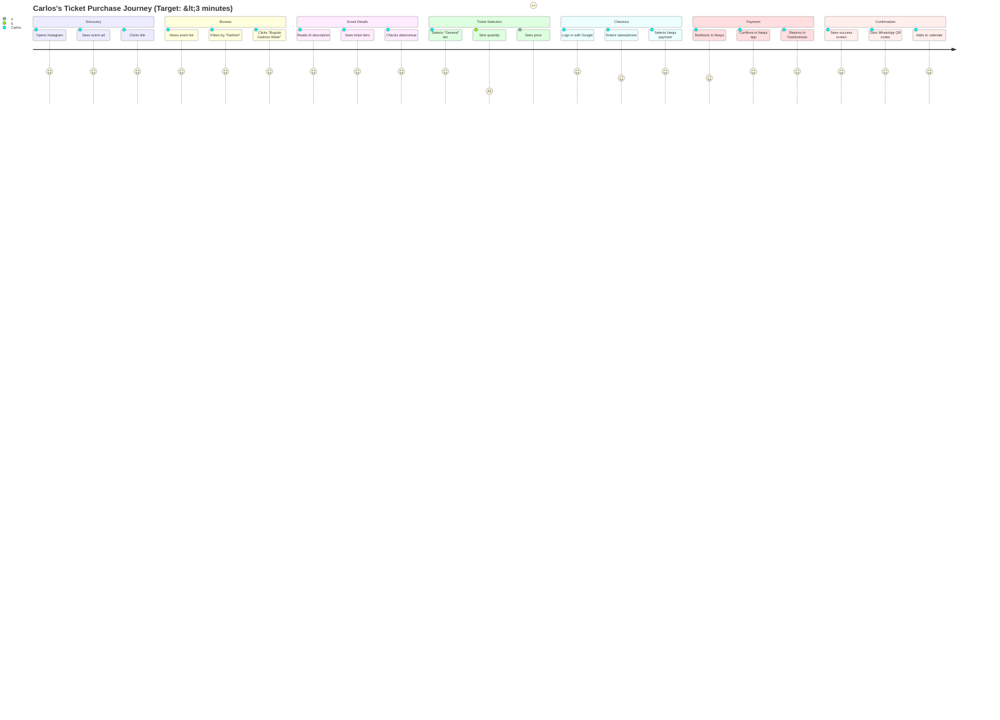
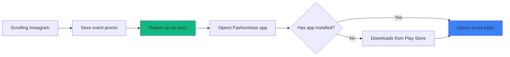
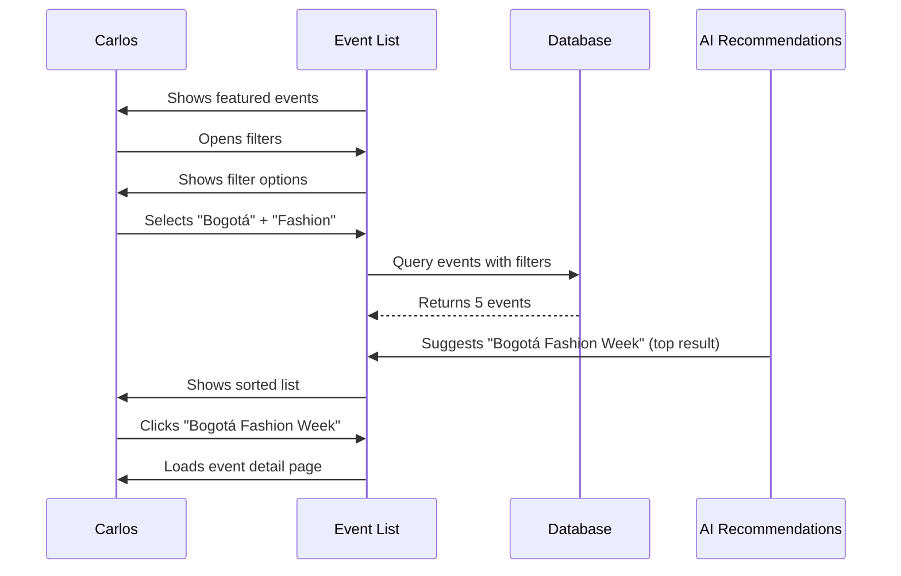
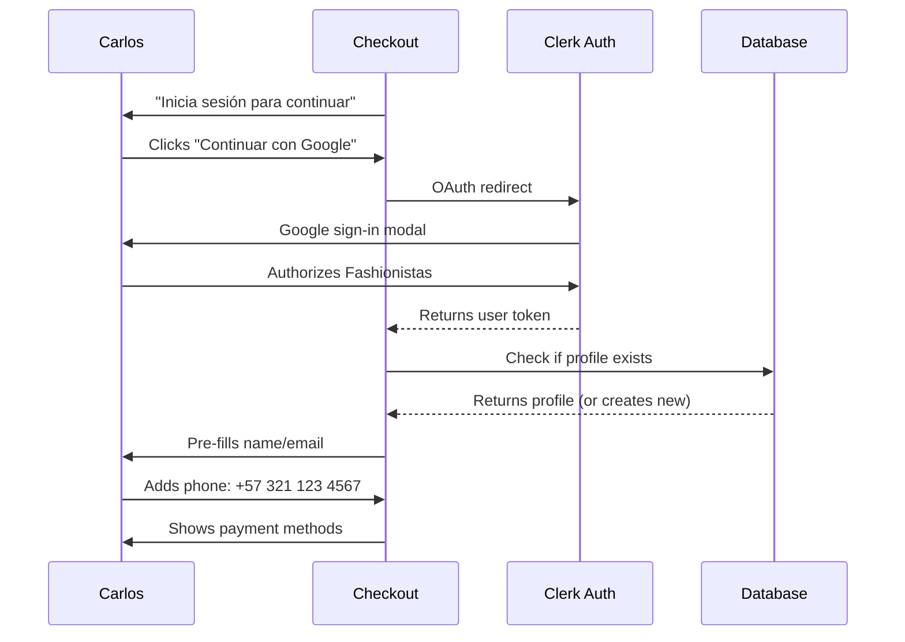
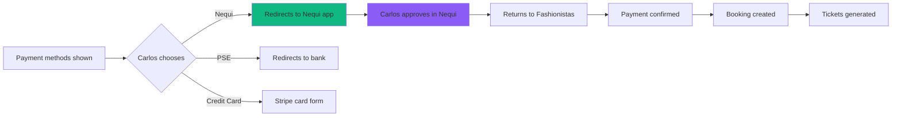
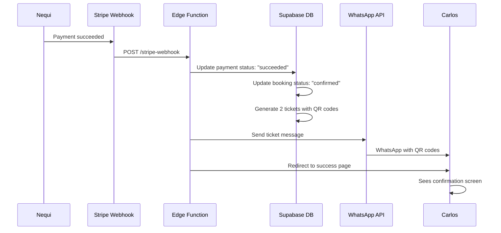

# User Journey: Carlos - Event Attendee
**Document ID:** 04
**Version:** 1.0
**Last Updated:** January 7, 2025
**Owner:** UX Team
**Status:** 🟢 Approved

---

## 🎯 Purpose
Complete user journey map for Carlos Méndez, a fashion enthusiast purchasing tickets to "Bogotá Fashion Week 2025" through the public event listing and checkout flow.

---

## 👤 Persona: Carlos Méndez

**Role:** Fashion Enthusiast / Attendee  
**Age:** 26  
**Location:** Medellín, Colombia  
**Profession:** Graphic Designer  
**Tech Comfort:** High (early adopter, uses mobile apps daily)  
**Primary Device:** Samsung Galaxy S23 (Android)  
**Payment Method:** Nequi, PSE, Credit Card  
**Language:** Spanish (native)

### Goals
- Find cool fashion events in Colombia
- Buy 2 General tickets for Bogotá Fashion Week
- Get QR code tickets on WhatsApp
- Receive event reminders

### Pain Points
- Other platforms have slow, clunky checkout
- Hidden fees revealed at final step
- No mobile wallet support (Nequi/Daviplata)
- Tickets arrive via email (hard to find later)

---

## 🗺️ Journey Map Overview



---

## 📱 Step-by-Step Journey

### Step 1: Discovery via Social Media (0:00 - 0:30)

**Channel:** Instagram Story  
**Action:** Carlos sees Maria's event promo, clicks link  
**Emotion:** 😃 Excited about fashion event



**Instagram Story Ad:**
- 📸 Hero image of fashion show
- 🎭 Text: "Bogotá Fashion Week 2025"
- 📅 Date: "15 de marzo, 19:00"
- 🎟️ CTA: "Comprar entradas" (Swipe up)
- 💬 "300 personas interesadas"

**Deep Link:**
`fashionistas.app/events/bogota-fashion-week-2025?source=instagram`

**Success Criteria:**
- ✅ Deep link opens app or prompts install
- ✅ Event page loads <2s
- ✅ No login required to view event

---

### Step 2: Browse Event List (0:30 - 1:00)

**Screen:** Public Event Listing Page  
**Action:** Carlos filters events by city/category  
**Emotion:** 😊 Easy to find relevant events



**Event Card (List View):**
- 🖼️ Event image (16:9 ratio)
- 🎭 Title: "Bogotá Fashion Week 2025"
- 📅 Date: "Sáb, 15 de marzo, 19:00"
- 📍 Venue: "Teatro Colón"
- 🎟️ Price: "Desde $40,000 COP"
- 🔥 Badge: "85% vendido" (urgency)
- ⭐ Organizer: "Fashion Week Colombia ✓ Verificado"

**Filters Available:**
- City (Bogotá, Medellín, Cali, etc.)
- Category (Fashion, Music, Art, etc.)
- Date (This week, This month, Custom)
- Price (Free, <$50k, $50k-$100k, $100k+)

**AI Recommendations (Bottom of list):**
- "Based on your interests: Medellín Fashion Gala"
- "Popular in Bogotá: Colombia Design Week"

**Success Criteria:**
- ✅ Filter results instant (<500ms)
- ✅ Relevant results based on user location
- ✅ AI recommendations accurate >70%

---

### Step 3: Event Detail Page (1:00 - 2:00)

**Screen:** Event Landing Page  
**Action:** Carlos reads details, views ticket options  
**Emotion:** 🤩 Impressed by detailed info & AI description

```mermaid
flowchart TD
    A[Event page loads] --> B[Hero image + title]
    B --> C[Carlos scrolls down]
    C --> D[Reads AI-generated description]
    D --> E[Views ticket tiers table]
    E --> F{Decides on tier}
    F -->|VIP too expensive| G[Selects General: $80k]
    F -->|Student discount| H[Selects Student: $40k]
    G --> I[Clicks "Comprar"]
    H --> I
    I --> J[Ticket selection modal opens]
    
    style D fill:#8b5cf6
    style I fill:#10b981
```

**Page Sections:**

1. **Hero Section**
   - Full-width event image
   - Floating CTA: "Comprar Entradas" (sticky on scroll)
   - Event badges: ✓ Verificado, 🔥 85% vendido

2. **Event Info**
   - 🎭 Title: "Bogotá Fashion Week 2025"
   - 📅 Date/Time: "Sábado, 15 de marzo de 2025, 19:00 - 23:00"
   - 📍 Venue: "Teatro Colón, Carrera 7 #6-32, Bogotá"
   - 👥 Capacity: "300 asistentes"
   - 🎤 Organizer: "Fashion Week Colombia" (clickable profile)

3. **Description** (AI-generated by Maria)
   > "Experience Bogotá Fashion Week 2025: A stunning showcase of Colombia's top 10 emerging designers, featuring eco-conscious collections that blend traditional craftsmanship with modern innovation..."

4. **Ticket Tiers**

| Tier | Price | Available | Benefits |
|------|-------|-----------|----------|
| **VIP** | $180,000 COP | 12/50 | 🌟 Front row + Backstage + Meet designers |
| **General** | $80,000 COP | 145/200 | 💺 Seated section + Event program |
| **Student** | $40,000 COP | 48/50 | 🎓 Standing (ID required) |

5. **Venue Map** (Google Maps embed)
6. **Organizer Profile** (link to Fashion Week Colombia page)
7. **FAQ Section**
   - "¿Cuál es la política de cancelación?"
   - "¿Hay descuentos grupales?"
   - "¿Qué incluye el boleto VIP?"

**Interactive Elements:**
- 📸 Photo gallery (5 images)
- 📍 "Cómo llegar" (directions in Google Maps)
- 📅 "Agregar a calendario" button
- 📤 "Compartir" (WhatsApp, Instagram, Twitter)

**Success Criteria:**
- ✅ Page load time <2s
- ✅ Mobile responsive (no horizontal scroll)
- ✅ CTA visible at all scroll positions

---

### Step 4: Ticket Selection (2:00 - 2:30)

**Screen:** Ticket Selection Modal  
**Action:** Carlos chooses General tier, quantity = 2  
**Emotion:** 😊 Clear pricing, no hidden fees

```mermaid
graph TD
    A[Modal opens] --> B[Shows 3 tiers as cards]
    B --> C[Carlos taps "General" card]
    C --> D[Card expands with details]
    D --> E[Quantity selector appears]
    E --> F[Carlos taps +/+ to reach 2]
    F --> G[Price updates: $160,000 COP]
    G --> H[Platform fee shown: $8,000]
    H --> I[Total: $168,000 COP]
    I --> J{Carlos accepts?}
    J -->|Yes| K[Clicks "Continuar al pago"]
    J -->|No| L[Adjusts quantity or tier]
    L --> E
    K --> M[Redirects to checkout]
    
    style H fill:#f59e0b
    style K fill:#10b981
```

**Ticket Selection UI:**

**Tier Cards (3 columns on desktop, stack on mobile):**
- **General Tier (selected)**
  - 💺 Icon: Seated
  - Price: $80,000 COP
  - Available: 145/200
  - Quantity: `[-]` **2** `[+]`
  - Benefits: ✓ Seated section, ✓ Event program

**Price Breakdown:**
```
Subtotal (2x General):     $160,000 COP
Plataforma (5%):            $8,000 COP
────────────────────────────────────
Total:                     $168,000 COP
```

**Fee Transparency:**
- ℹ️ Tooltip: "El 5% cubre procesamiento de pago y soporte"
- 🔒 "Pago 100% seguro con Stripe"

**Urgency Indicators:**
- 🔥 "¡Solo 145 entradas disponibles!"
- 👥 "23 personas viendo este evento ahora"

**Success Criteria:**
- ✅ Fee shown upfront (no surprise at checkout)
- ✅ Quantity limits enforced (max = available)
- ✅ Price updates instantly on quantity change

---

### Step 5: Checkout & Login (2:30 - 3:00)

**Screen:** Checkout Page  
**Action:** Carlos logs in with Google, fills contact info  
**Emotion:** 😎 Fast login, no lengthy forms



**Login Options:**
- 🔐 Continuar con Google (recommended)
- 📧 Continuar con Email
- 📱 Continuar con teléfono

**Checkout Form (Pre-filled from Google):**
- Nombre: "Carlos Méndez" ✅ (from Google)
- Email: "carlos.mendez@gmail.com" ✅ (from Google)
- Teléfono: `+57 [___] [___] [____]` (required for WhatsApp)

**Order Summary (Sticky sidebar on desktop):**
- 🎭 Bogotá Fashion Week 2025
- 🎟️ 2x General ($80,000 cada uno)
- 📅 15 de marzo, 19:00
- 💰 Total: $168,000 COP

**Success Criteria:**
- ✅ Google login <5 seconds
- ✅ Phone validation (Colombian format)
- ✅ No unnecessary fields

---

### Step 6: Payment Method Selection (3:00 - 3:30)

**Screen:** Payment Options  
**Action:** Carlos selects Nequi (mobile wallet)  
**Emotion:** 😍 Happy to use familiar payment method



**Payment Methods (Colombian-specific):**

1. **💜 Nequi** (Most popular)
   - Logo + "Paga con tu billetera Nequi"
   - "Aprobación instantánea"

2. **🏦 PSE (Pagos Seguros en Línea)**
   - "Paga desde tu banco"
   - Supported banks: Bancolombia, Davivienda, etc.

3. **💳 Tarjeta de Crédito/Débito**
   - Visa, Mastercard, American Express
   - Powered by Stripe

4. **📱 Daviplata** (Alternative wallet)

**Payment Flow (Nequi):**
1. Carlos clicks "Pagar con Nequi"
2. Redirect to Nequi app (or web if not installed)
3. Nequi shows: "Fashionistas - $168,000 COP"
4. Carlos enters Nequi PIN
5. Confirms payment
6. Nequi sends webhook to Fashionistas
7. Redirect back to success page

**Security Indicators:**
- 🔒 "Pago procesado por Stripe (certificado PCI)"
- 🛡️ "Tus datos no se almacenan"
- 📞 "Soporte 24/7: soporte@fashionistas.app"

**Success Criteria:**
- ✅ Nequi payment success rate >90%
- ✅ PSE payment success rate >85%
- ✅ Card payment success rate >95%
- ✅ Clear error messages on payment failure

---

### Step 7: Payment Confirmation (3:30 - 4:00)

**Screen:** Success Page + WhatsApp Notification  
**Action:** Carlos receives tickets via WhatsApp with QR codes  
**Emotion:** 🎉 Excited, tickets secured!



**Success Page Content:**

**Header:**
- ✅ "¡Compra confirmada!"
- 🎟️ "Tus entradas están listas"

**Booking Details Card:**
- 🎭 Event: "Bogotá Fashion Week 2025"
- 📅 Fecha: "Sáb, 15 de marzo, 19:00"
- 📍 Lugar: "Teatro Colón, Bogotá"
- 🎟️ Entradas: 2x General
- 💰 Total pagado: $168,000 COP
- 🆔 Referencia: `BFW2025-ABC123`

**QR Code Display:**
- 📱 "Muestra estos códigos QR en la entrada"
- [QR Code 1] - Entrada #1
- [QR Code 2] - Entrada #2
- 💾 "Guardado en tu perfil"

**Action Buttons:**
- 📅 Agregar al calendario (Google/Apple)
- 📱 Ver en WhatsApp
- 📤 Compartir con amigos
- 📧 Reenviar por email

**WhatsApp Message (Sent to +57 321 123 4567):**
```
🎉 ¡Compra confirmada!

📅 Bogotá Fashion Week 2025
🗓️ Sábado, 15 de marzo, 19:00
📍 Teatro Colón, Carrera 7 #6-32

🎟️ Tienes 2 entradas:
━━━━━━━━━━━━
[QR CODE IMAGE 1]
Entrada #1 - General
━━━━━━━━━━━━
[QR CODE IMAGE 2]
Entrada #2 - General
━━━━━━━━━━━━

💡 Guarda este mensaje. Lo necesitarás en la entrada.

🔗 Ver detalles: fashionistas.app/bookings/BFW2025-ABC123

📞 ¿Problemas? +57 300 123 4567
```

**Success Criteria:**
- ✅ Success page loads <2s after payment
- ✅ WhatsApp delivery within 30s
- ✅ QR codes scannable (tested with event scanner app)
- ✅ Calendar invite format compatible (ICS)

---

### Step 8: Pre-Event Reminders (Days Before Event)

**Reminder Schedule:**
- **7 days before:** "¡Tu evento es en 1 semana!"
- **1 day before:** "¡Mañana es el gran día!"
- **3 hours before:** "Tu evento empieza en 3 horas"

**Reminder Content (WhatsApp):**
```
🔔 Recordatorio

🎭 Bogotá Fashion Week 2025
⏰ Mañana, 15 de marzo, 19:00
📍 Teatro Colón

✅ ¿Qué llevar?
• Tu teléfono con los códigos QR
• Documento de identidad

💡 Consejos:
• Llega 30 min antes (las puertas abren a 18:30)
• Estacionamiento disponible en Cra 7
• Dress code: Semi-formal

📸 ¿Vas a publicar en Instagram?
Usa #BogotáFashionWeek2025 y etiqueta a @fashionweekcolombia

🔗 Ver entradas: [link]
```

**Success Criteria:**
- ✅ Reminders sent at correct times
- ✅ Open rate >70%
- ✅ Links work correctly

---

## 📊 Attendee Journey Metrics

### Conversion Funnel

```mermaid
funnel
    title Ticket Purchase Funnel
    "Event Page Views" : 1000
    "Ticket Modal Opened" : 650
    "Added to Cart" : 500
    "Started Checkout" : 450
    "Completed Login" : 400
    "Selected Payment" : 380
    "Payment Succeeded" : 342
```

**Conversion Rates:**
- Event View → Ticket Modal: 65%
- Ticket Modal → Checkout: 77%
- Checkout → Payment: 84%
- **Overall Conversion: 34.2%** (Target: 40%)

**Drop-off Analysis:**
- **Largest drop: Ticket Modal → Checkout (23%)**
  - Fix: Reduce login friction, allow guest checkout
- **Second largest: Payment Selection → Success (10%)**
  - Fix: Improve Nequi/PSE error handling

### Time Metrics

| Stage | Target | Actual Avg | Status |
|-------|--------|------------|--------|
| Event browsing | 0:30 | 0:45 | 🟡 Needs filter optimization |
| Event details review | 1:00 | 1:15 | 🟢 Good |
| Ticket selection | 0:30 | 0:25 | 🟢 Excellent |
| Checkout + login | 0:30 | 0:40 | 🟡 Login can be faster |
| Payment (Nequi) | 1:00 | 0:50 | 🟢 Excellent |
| **Total** | **3:30** | **3:55** | 🟡 **Target: <3 min** |

### Payment Method Breakdown

| Method | Usage % | Success Rate | Avg Time |
|--------|---------|--------------|----------|
| **Nequi** | 52% | 91% | 0:50 |
| **PSE** | 28% | 87% | 1:30 |
| **Credit Card** | 20% | 96% | 1:00 |

**Insights:**
- Nequi is most popular but has lower success rate (abandoned transactions)
- Credit cards have highest success but users prefer Colombian methods
- PSE slowest due to bank redirects

---

## 📱 Mobile Experience Optimizations

### Carlos uses Samsung Galaxy S23 (Android)

**Mobile-Specific Features:**
- 📲 Deep linking from Instagram → Event page
- 💳 Nequi/Daviplata native app integration
- 📱 WhatsApp QR code delivery (easier than email)
- 📅 One-tap calendar add (Google Calendar)
- 🔔 Push notifications (if app installed)

**Performance Targets:**
- ✅ Page load (3G): <4s
- ✅ Time to Interactive: <3s
- ✅ Lighthouse Score: 90+

**Responsive Design:**
- 375px: Single column layout
- 768px: Two column (event info + sidebar)
- 1024px+: Full desktop experience

---

## ✅ Success Criteria Summary

**Must-Have (Red Flags):**
- ✅ End-to-end purchase <4 minutes
- ✅ Nequi/PSE payment options available
- ✅ QR codes delivered via WhatsApp within 30s
- ✅ Mobile-responsive checkout (no horizontal scroll)
- ✅ Fees shown upfront (no surprises)

**Should-Have:**
- 🟡 Conversion rate >35% (currently 34.2%)
- 🟡 Payment success rate >90% all methods
- 🟡 WhatsApp reminders sent on schedule
- 🟡 Calendar invite works (Google + Apple)

**Nice-to-Have:**
- 🟢 AI recommends similar events post-purchase
- 🟢 Social sharing incentives (discount for sharing)
- 🟢 Group ticket discounts

---

## 🔗 Related Documents

- **Organizer Journey**: `03-USER-JOURNEY-MARIA-ORGANIZER.md`
- **State Machine Flow**: `01-STATE-MACHINE-FLOW-DIAGRAM.md`
- **Database Schema**: `02-DATABASE-ERD-COMPLETE.md`
- **UI Wireframes**: `05-UI-UX-WIREFRAMES-ALL-STAGES.md`

---

**Document Complete** ✅
**Next Document**: `05-UI-UX-WIREFRAMES-ALL-STAGES.md`
