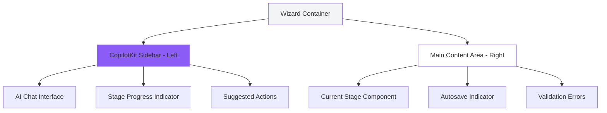
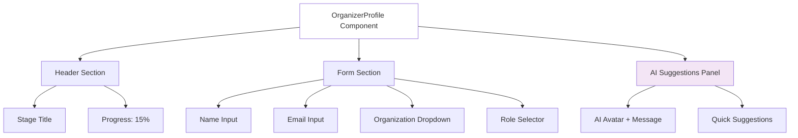
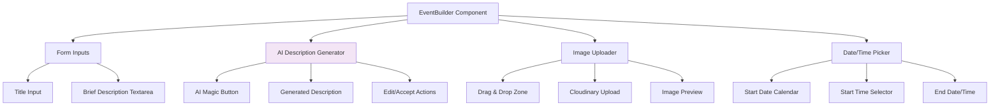
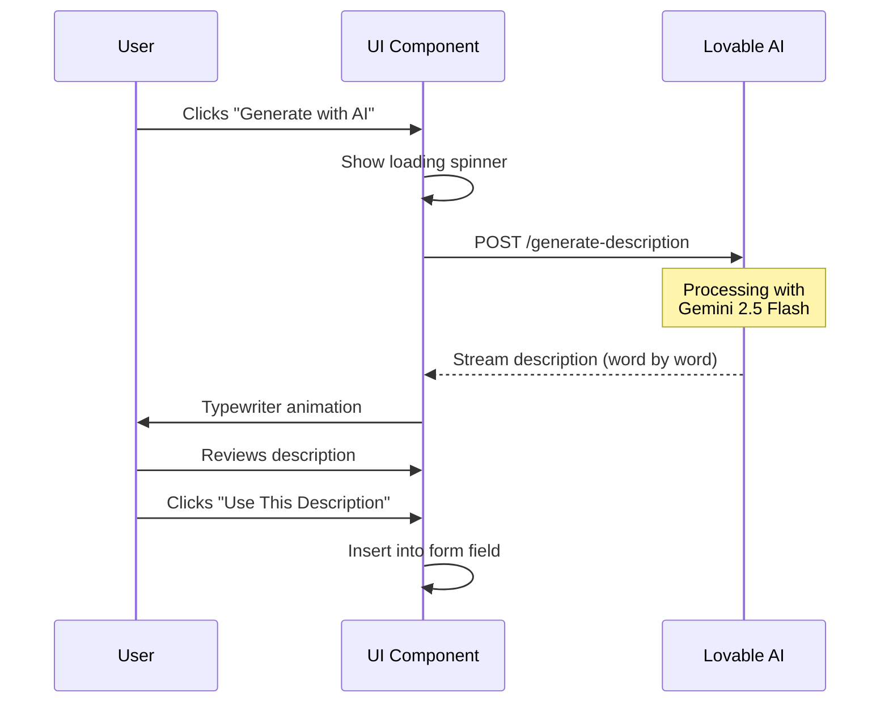
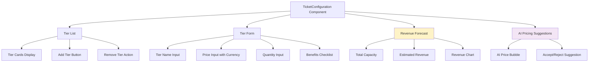
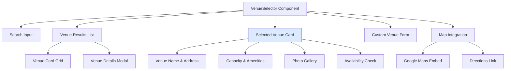
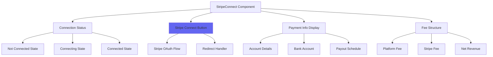
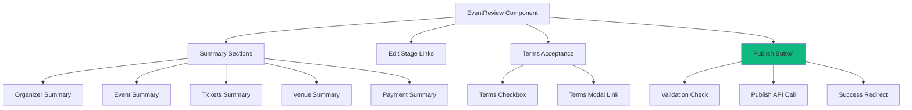
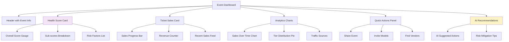
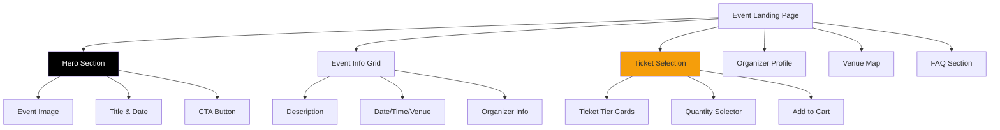

# UI/UX Wireframes - All Wizard Stages & Dashboard
**Document ID:** 05
**Version:** 1.0
**Last Updated:** January 7, 2025
**Owner:** Design Team
**Status:** 🟢 Approved

---

## 🎯 Purpose
Visual layout specifications for all 6 Event Wizard stages, dashboard pages, and public event landing page with component hierarchies and responsive breakpoints.

---

## 📊 Design System Reference

### Color Palette (Colombian Fashion Aesthetic)

```css
/* Primary Colors */
--primary-black: #000000;     /* Elegance, sophistication */
--primary-white: #FFFFFF;     /* Clean, minimal */
--accent-purple: #8B5CF6;     /* AI features, premium */
--accent-gold: #F59E0B;       /* Highlights, success */

/* Neutrals */
--gray-50: #F9FAFB;
--gray-100: #F3F4F6;
--gray-600: #4B5563;
--gray-900: #111827;

/* Semantic Colors */
--success: #10B981;
--warning: #F59E0B;
--error: #EF4444;
--info: #3B82F6;
```

### Typography

```css
/* Headings */
--font-heading: 'Playfair Display', serif;  /* Elegant fashion vibe */
--font-body: 'Inter', sans-serif;           /* Clean, readable */

/* Sizes */
--text-xs: 0.75rem;   /* 12px */
--text-sm: 0.875rem;  /* 14px */
--text-base: 1rem;    /* 16px */
--text-lg: 1.125rem;  /* 18px */
--text-xl: 1.25rem;   /* 20px */
--text-2xl: 1.5rem;   /* 24px */
--text-3xl: 1.875rem; /* 30px */
```

### Spacing System

```css
--space-1: 0.25rem;  /* 4px */
--space-2: 0.5rem;   /* 8px */
--space-3: 0.75rem;  /* 12px */
--space-4: 1rem;     /* 16px */
--space-6: 1.5rem;   /* 24px */
--space-8: 2rem;     /* 32px */
--space-12: 3rem;    /* 48px */
```

---

## 🎨 Wizard Container Layout

### Overall Wizard Structure



### Desktop Layout (1440px)

```
┌────────────────────────────────────────────────────────────┐
│  Header: Fashionistas Logo    |    Save Status: ✓ Saved    │
├──────────────────┬─────────────────────────────────────────┤
│                  │                                           │
│  CopilotKit      │         Main Stage Content              │
│  Sidebar         │         (Dynamic Component)             │
│  (400px width)   │                                           │
│                  │                                           │
│  🤖 AI Chat      │         [Stage 1-6 Component]           │
│                  │                                           │
│  ● Stage 1 ✓     │                                           │
│  ● Stage 2 ✓     │                                           │
│  ○ Stage 3       │                                           │
│  ○ Stage 4       │                                           │
│  ○ Stage 5       │                                           │
│  ○ Stage 6       │                                           │
│                  │                                           │
│  💬 "Let me      │                                           │
│     help you..."  │                                           │
│                  │                                           │
└──────────────────┴─────────────────────────────────────────┘
```

### Mobile Layout (375px)

```
┌───────────────────────────┐
│  ☰ Menu   🤖 AI   ✓ Saved │
├───────────────────────────┤
│                           │
│   Main Stage Content      │
│   (Full Width)            │
│                           │
│   [Stage Component]       │
│                           │
│   ━━━━━━━━━━━━━━━━━━━━   │
│   Progress: ●●●○○○ 50%    │
│                           │
│   [Fixed Bottom AI Chat]  │
│   💬 "Need help?"         │
└───────────────────────────┘
```

**Mobile Adaptations:**
- CopilotKit sidebar becomes bottom sheet (swipe up)
- Stage content uses full width
- Progress indicator at bottom
- Sticky AI chat button (floating action button)

---

## 🏗️ Stage 1: Organizer Setup

### Component Hierarchy



### Desktop Wireframe (1440px)

```
┌─────────────────────────────────────────────────────┐
│  Stage 1: Organizer Setup                15% ●○○○○○  │
├─────────────────────────────────────────────────────┤
│                                                       │
│  Let's start with your information                   │
│  ━━━━━━━━━━━━━━━━━━━━━━━━━━━━━━━━━━━━━━━━━━━━━━━   │
│                                                       │
│  Full Name *                                          │
│  ┌─────────────────────────────────────────────┐    │
│  │ Maria Rodriguez                              │    │
│  └─────────────────────────────────────────────┘    │
│                                                       │
│  Email Address *                                      │
│  ┌─────────────────────────────────────────────┐    │
│  │ maria@fashionweek.co              ✓ Valid   │    │
│  └─────────────────────────────────────────────┘    │
│                                                       │
│  Organization                                         │
│  ┌─────────────────────────────────────────────┐    │
│  │ Fashion Week Colombia             ▼         │    │
│  └─────────────────────────────────────────────┘    │
│                                                       │
│  Role                                                 │
│  ┌──────────┐ ┌──────────┐ ┌──────────┐            │
│  │ Organizer│ │  Vendor  │ │ Designer │            │
│  │    ✓     │ │          │ │          │            │
│  └──────────┘ └──────────┘ └──────────┘            │
│                                                       │
│  ┌───────────────────────────────────────────┐      │
│  │ 🤖 AI Suggestion:                          │      │
│  │ "I see you're from Fashion Week Colombia!  │      │
│  │  Would you like me to pre-fill event       │      │
│  │  details from your past events?"           │      │
│  │                                             │      │
│  │  [Yes, use past data] [No, start fresh]   │      │
│  └───────────────────────────────────────────┘      │
│                                                       │
│                 ⏳ Autosaving...                      │
└─────────────────────────────────────────────────────┘
```

### Mobile Wireframe (375px)

```
┌─────────────────────────┐
│ Stage 1: Organizer      │
│ ●○○○○○ 15%             │
├─────────────────────────┤
│                         │
│ Let's start with your   │
│ information             │
│                         │
│ Full Name *             │
│ ┌─────────────────────┐ │
│ │ Maria Rodriguez     │ │
│ └─────────────────────┘ │
│                         │
│ Email *                 │
│ ┌─────────────────────┐ │
│ │ maria@fashionweek.co│ │
│ │ ✓ Valid             │ │
│ └─────────────────────┘ │
│                         │
│ Organization            │
│ ┌─────────────────────┐ │
│ │ Fashion Week  ▼     │ │
│ └─────────────────────┘ │
│                         │
│ Role                    │
│ ┌─────────────────────┐ │
│ │ ● Organizer         │ │
│ │ ○ Vendor            │ │
│ │ ○ Designer          │ │
│ └─────────────────────┘ │
│                         │
│ ⏳ Autosaving...        │
│                         │
└─────────────────────────┘
```

**Validation States:**
- ✓ Valid (green checkmark)
- ❌ Invalid (red text below field)
- ⏳ Validating... (spinner)

---

## 🎭 Stage 2: Event Details

### Component Hierarchy



### Desktop Wireframe (1440px)

```
┌─────────────────────────────────────────────────────┐
│  Stage 2: Event Details                  35% ●●○○○○  │
├─────────────────────────────────────────────────────┤
│                                                       │
│  Tell us about your event                            │
│  ━━━━━━━━━━━━━━━━━━━━━━━━━━━━━━━━━━━━━━━━━━━━━━━   │
│                                                       │
│  Event Title *                                        │
│  ┌─────────────────────────────────────────────┐    │
│  │ Bogotá Fashion Week 2025                     │    │
│  └─────────────────────────────────────────────┘    │
│                                                       │
│  Brief Description (AI will expand this)             │
│  ┌─────────────────────────────────────────────┐    │
│  │ Fashion show with 10 emerging Colombian      │    │
│  │ designers showcasing sustainable fashion     │    │
│  │                                               │    │
│  └─────────────────────────────────────────────┘    │
│                                                       │
│  ┌─────────────────────┐                             │
│  │ ✨ Generate with AI │  ← Click to generate        │
│  └─────────────────────┘                             │
│                                                       │
│  ┌───────────────────────────────────────────┐      │
│  │ 📝 AI-Generated Description:               │      │
│  │ ──────────────────────────────────────────  │      │
│  │ "Experience Bogotá Fashion Week 2025:      │      │
│  │  A stunning showcase of Colombia's top 10   │      │
│  │  emerging designers, featuring eco-conscious│      │
│  │  collections that blend traditional         │      │
│  │  craftsmanship with modern innovation..."   │      │
│  │                                             │      │
│  │  [✏️ Edit] [✓ Use This Description]        │      │
│  └───────────────────────────────────────────┘      │
│                                                       │
│  Event Image *                                        │
│  ┌─────────────────────────────────────────────┐    │
│  │  📸 Drag & drop or click to upload          │    │
│  │                                               │    │
│  │  [         Upload Area (16:9 ratio)        ] │    │
│  │                                               │    │
│  │  Recommended: 1920x1080px, max 5MB          │    │
│  └─────────────────────────────────────────────┘    │
│                                                       │
│  Date & Time                                          │
│  ┌──────────────────┐  ┌──────────────────┐         │
│  │ Start Date       │  │ Start Time       │         │
│  │ 📅 Mar 15, 2025  │  │ 🕐 19:00         │         │
│  └──────────────────┘  └──────────────────┘         │
│  ┌──────────────────┐  ┌──────────────────┐         │
│  │ End Date         │  │ End Time         │         │
│  │ 📅 Mar 15, 2025  │  │ 🕐 23:00         │         │
│  └──────────────────┘  └──────────────────┘         │
│                                                       │
│                 ✓ Auto-saved 2s ago                  │
└─────────────────────────────────────────────────────┘
```

### AI Description Animation



**Animation Details:**
- ⏳ Loading: Pulsing purple gradient on button
- ✍️ Typing: Words appear one at a time (50ms delay)
- ✨ Completion: Subtle fade-in of action buttons

---

## 🎟️ Stage 3: Ticket Configuration

### Component Hierarchy



### Desktop Wireframe (1440px)

```
┌─────────────────────────────────────────────────────────────────┐
│  Stage 3: Ticket Configuration              50% ●●●○○○            │
├─────────────────────────────────────────────────────────────────┤
│                                                                   │
│  Configure your ticket tiers                                     │
│  ━━━━━━━━━━━━━━━━━━━━━━━━━━━━━━━━━━━━━━━━━━━━━━━━━━━━━━━━━━   │
│                                                                   │
│  ┌─────────────────────────────────────────────────────────┐    │
│  │ 📊 Revenue Forecast                                      │    │
│  │ ──────────────────────────────────────────────────────   │    │
│  │ Total Capacity:       300 tickets                        │    │
│  │ Estimated Revenue:    $22,000,000 COP (if 100% sold)    │    │
│  │                                                           │    │
│  │ [━━━━━━━━━━━━━━━━━━━━━━━━━━] Revenue Distribution       │    │
│  │ VIP: $9M (41%)  General: $16M (50%)  Student: $2M (9%)  │    │
│  └─────────────────────────────────────────────────────────┘    │
│                                                                   │
│  Ticket Tiers                                                    │
│                                                                   │
│  ┌─────────────────┐ ┌─────────────────┐ ┌─────────────────┐   │
│  │ 🌟 VIP          │ │ 💺 General      │ │ 🎓 Student      │   │
│  │                 │ │                 │ │                 │   │
│  │ $180,000 COP    │ │ $80,000 COP     │ │ $40,000 COP     │   │
│  │ 💡 AI: $150k    │ │ ✓ AI Price      │ │ ✓ AI Price      │   │
│  │                 │ │                 │ │                 │   │
│  │ Quantity: 50    │ │ Quantity: 200   │ │ Quantity: 50    │   │
│  │                 │ │                 │ │                 │   │
│  │ ✓ Front row     │ │ ✓ Seated        │ │ ✓ Standing      │   │
│  │ ✓ Backstage     │ │ ✓ Program       │ │ ✓ Student ID    │   │
│  │ ✓ Meet designers│ │                 │ │   required      │   │
│  │                 │ │                 │ │                 │   │
│  │ [✏️ Edit]  [🗑️] │ │ [✏️ Edit]  [🗑️] │ │ [✏️ Edit]  [🗑️] │   │
│  └─────────────────┘ └─────────────────┘ └─────────────────┘   │
│                                                                   │
│  ┌─────────────────────────────┐                                │
│  │ + Add Another Tier (max 5)  │                                │
│  └─────────────────────────────┘                                │
│                                                                   │
│  ⚠️ Warning: Total capacity (300) matches venue capacity         │
│                                                                   │
│                         ✓ Auto-saved 5s ago                      │
└─────────────────────────────────────────────────────────────────┘
```

### Add/Edit Tier Modal

```
┌───────────────────────────────────────┐
│  Add Ticket Tier                 [✕]  │
├───────────────────────────────────────┤
│                                        │
│  Tier Name *                           │
│  ┌──────────────────────────────────┐ │
│  │ VIP                              │ │
│  └──────────────────────────────────┘ │
│                                        │
│  Price *                               │
│  ┌──────────┐  ┌────────────────────┐ │
│  │ COP   ▼  │  │ 180000             │ │
│  └──────────┘  └────────────────────┘ │
│                                        │
│  💡 AI Suggestion: $150,000 COP        │
│     Based on similar events at         │
│     Teatro Colón                       │
│     [Use AI Price] [Keep Mine]        │
│                                        │
│  Quantity Available *                  │
│  ┌──────────────────────────────────┐ │
│  │ 50                               │ │
│  └──────────────────────────────────┘ │
│                                        │
│  Benefits (select all that apply)      │
│  ☑️ Front row seating                  │
│  ☑️ Backstage access                   │
│  ☑️ Meet & greet with designers        │
│  ☑️ VIP lounge                         │
│  ☐ Complimentary drink                 │
│  ☐ Event merchandise                   │
│                                        │
│  ┌────────────┐  ┌────────────┐       │
│  │   Cancel   │  │  Save Tier │       │
│  └────────────┘  └────────────┘       │
└───────────────────────────────────────┘
```

**AI Pricing Logic Display:**
```
💡 AI analyzed 15 similar fashion events in Bogotá:
   • Teatro Colón VIP avg: $145,000 COP
   • Fashion Week historical: $150,000 - $200,000
   • Your venue capacity: 300 (medium)
   • Recommendation: $150,000 COP
```

---

## 📍 Stage 4: Venue Selection

### Component Hierarchy



### Desktop Wireframe (1440px)

```
┌─────────────────────────────────────────────────────────────────┐
│  Stage 4: Venue Selection                   65% ●●●●○○            │
├─────────────────────────────────────────────────────────────────┤
│                                                                   │
│  Where will your event take place?                               │
│  ━━━━━━━━━━━━━━━━━━━━━━━━━━━━━━━━━━━━━━━━━━━━━━━━━━━━━━━━━━   │
│                                                                   │
│  ┌──────────────────────────────────────────────────────────┐   │
│  │ 🔍 Search venues in Bogotá...               [Search]     │   │
│  └──────────────────────────────────────────────────────────┘   │
│                                                                   │
│  Search Results (3 found)                                        │
│                                                                   │
│  ┌─────────────────────────────────────────────────────────┐    │
│  │ 📍 Teatro Colón - Main Hall                   ⭐ 4.8     │    │
│  │ ──────────────────────────────────────────────────────   │    │
│  │ [Image 1] [Image 2] [Image 3]                           │    │
│  │                                                           │    │
│  │ 📍 Carrera 7 #6-32, La Candelaria, Bogotá               │    │
│  │ 👥 Capacity: 300 seated                                  │    │
│  │ 💰 Hourly Rate: $500,000 COP                             │    │
│  │                                                           │    │
│  │ ✨ Amenities:                                            │    │
│  │ ✓ Professional stage      ✓ Sound system                │    │
│  │ ✓ Lighting equipment      ✓ 4 dressing rooms            │    │
│  │ ✓ VIP lounge             ✓ Bar service                  │    │
│  │                                                           │    │
│  │ ✅ Available on March 15, 2025                          │    │
│  │                                                           │    │
│  │ ┌───────────────┐  ┌───────────────┐                   │    │
│  │ │ View Details  │  │ Select Venue  │  ← Selected       │    │
│  │ └───────────────┘  └───────────────┘                   │    │
│  └─────────────────────────────────────────────────────────┘    │
│                                                                   │
│  ┌─────────────────────────────────────────────────────────┐    │
│  │ 📍 Centro de Convenciones Gonzalo Jiménez    ⭐ 4.6     │    │
│  │ ──────────────────────────────────────────────────────   │    │
│  │ [Images...]                                              │    │
│  │ 👥 Capacity: 500 seated                                  │    │
│  │ ⚠️ Too large for your event (300 tickets)               │    │
│  │                                                           │    │
│  │ [View Details]                                           │    │
│  └─────────────────────────────────────────────────────────┘    │
│                                                                   │
│  Can't find your venue?                                          │
│  ┌────────────────────────────┐                                 │
│  │ + Add Custom Venue         │                                 │
│  └────────────────────────────┘                                 │
│                                                                   │
│  ✅ Capacity validation passed                                  │
│                                                                   │
│                         ✓ Auto-saved 3s ago                      │
└─────────────────────────────────────────────────────────────────┘
```

### Venue Details Modal

```
┌───────────────────────────────────────────────────────────┐
│  Teatro Colón - Main Hall                            [✕]  │
├───────────────────────────────────────────────────────────┤
│                                                             │
│  [====== Photo Gallery (5 images) ======]                 │
│  [  Main stage view with professional lighting  ]          │
│  ← → Carousel navigation                                   │
│                                                             │
│  ━━━━━━━━━━━━━━━━━━━━━━━━━━━━━━━━━━━━━━━━━━━━━━━━━━━   │
│                                                             │
│  📍 Location                                               │
│  Carrera 7 #6-32, La Candelaria, Bogotá                   │
│  [== Embedded Google Map ==]                               │
│  [Get Directions]                                          │
│                                                             │
│  👥 Capacity                                               │
│  300 seated (200 main floor + 100 balcony)                │
│  ✅ Matches your ticket capacity (300)                     │
│                                                             │
│  💰 Pricing                                                │
│  Hourly Rate: $500,000 COP                                 │
│  Your event duration: 4 hours                              │
│  Estimated Cost: $2,000,000 COP                            │
│                                                             │
│  ✨ Amenities & Features                                   │
│  Stage & Performance:                                      │
│  ✓ Professional stage (12m x 8m)                           │
│  ✓ Runway extension available                              │
│  ✓ Professional lighting (DMX control)                     │
│  ✓ Sound system (Meyer Sound)                              │
│                                                             │
│  Backstage:                                                │
│  ✓ 4 dressing rooms                                        │
│  ✓ Hair & makeup stations                                  │
│  ✓ Wardrobe racks                                          │
│                                                             │
│  Guest Experience:                                         │
│  ✓ VIP lounge                                              │
│  ✓ Bar service                                             │
│  ✓ Coat check                                              │
│  ✓ Accessible entrance                                     │
│                                                             │
│  📅 Availability                                           │
│  ✅ Available on March 15, 2025                           │
│  ⚠️ Only 2 other dates available this month                │
│                                                             │
│  ┌────────────────┐  ┌────────────────┐                   │
│  │     Cancel     │  │  Select Venue  │                   │
│  └────────────────┘  └────────────────┘                   │
└───────────────────────────────────────────────────────────┘
```

---

## 💳 Stage 5: Payment Setup

### Component Hierarchy



### Desktop Wireframe - Not Connected (1440px)

```
┌─────────────────────────────────────────────────────────────────┐
│  Stage 5: Payment Setup                     85% ●●●●●○            │
├─────────────────────────────────────────────────────────────────┤
│                                                                   │
│  Connect your payment account                                    │
│  ━━━━━━━━━━━━━━━━━━━━━━━━━━━━━━━━━━━━━━━━━━━━━━━━━━━━━━━━━━   │
│                                                                   │
│  ┌─────────────────────────────────────────────────────────┐    │
│  │ 💳 Payment Processing by Stripe                          │    │
│  │                                                           │    │
│  │ Connect your Stripe account to receive payments from     │    │
│  │ ticket sales. Payouts happen automatically 2 days after  │    │
│  │ your event ends.                                         │    │
│  │                                                           │    │
│  │ 🔐 Your data is encrypted and secure                     │    │
│  └─────────────────────────────────────────────────────────┘    │
│                                                                   │
│  ┌─────────────────────────────────────────────────────────┐    │
│  │                                                           │    │
│  │                  ┌──────────────────────────┐            │    │
│  │                  │  Connect with Stripe     │            │    │
│  │                  │  [Stripe Logo] →         │            │    │
│  │                  └──────────────────────────┘            │    │
│  │                                                           │    │
│  └─────────────────────────────────────────────────────────┘    │
│                                                                   │
│  What you'll need:                                               │
│  ✓ Email address (will use: maria@fashionweek.co)               │
│  ✓ Business details (Fashion Week Colombia)                     │
│  ✓ Colombian bank account for payouts                            │
│  ✓ Government ID (cédula or passport)                            │
│                                                                   │
│  💰 Fee Structure                                                │
│  ┌─────────────────────────────────────────────────────────┐    │
│  │ Ticket Revenue:        $22,000,000 COP (estimated)      │    │
│  │ Stripe Processing:     -$660,000 (3%)                    │    │
│  │ Platform Fee:          -$1,100,000 (5%)                  │    │
│  │ ──────────────────────────────────────────────────────   │    │
│  │ Your Net Payout:       $20,240,000 COP (92%)            │    │
│  └─────────────────────────────────────────────────────────┘    │
│                                                                   │
│  ⏱️ Estimated onboarding time: 3-5 minutes                       │
│                                                                   │
└─────────────────────────────────────────────────────────────────┘
```

### Desktop Wireframe - Connected (1440px)

```
┌─────────────────────────────────────────────────────────────────┐
│  Stage 5: Payment Setup                     85% ●●●●●○            │
├─────────────────────────────────────────────────────────────────┤
│                                                                   │
│  ✅ Payment account connected                                    │
│  ━━━━━━━━━━━━━━━━━━━━━━━━━━━━━━━━━━━━━━━━━━━━━━━━━━━━━━━━━━   │
│                                                                   │
│  ┌─────────────────────────────────────────────────────────┐    │
│  │ ✅ Successfully connected to Stripe                      │    │
│  │                                                           │    │
│  │ Account ID: acct_1PQR...xyz                              │    │
│  │ Business Name: Fashion Week Colombia                      │    │
│  │ Bank Account: Bancolombia ****1234                        │    │
│  │                                                           │    │
│  │ ┌──────────────────┐  ┌──────────────────┐              │    │
│  │ │ View in Stripe   │  │ Change Account   │              │    │
│  │ └──────────────────┘  └──────────────────┘              │    │
│  └─────────────────────────────────────────────────────────┘    │
│                                                                   │
│  💰 Payment Summary                                              │
│  ┌─────────────────────────────────────────────────────────┐    │
│  │ Estimated Ticket Revenue:    $22,000,000 COP            │    │
│  │ Stripe Processing Fee (3%):  -$660,000                   │    │
│  │ Platform Fee (5%):           -$1,100,000                 │    │
│  │ ━━━━━━━━━━━━━━━━━━━━━━━━━━━━━━━━━━━━━━━━━━━━━━━━━━━   │    │
│  │ Your Net Payout (92%):       $20,240,000 COP            │    │
│  └─────────────────────────────────────────────────────────┘    │
│                                                                   │
│  📅 Payout Schedule                                              │
│  Funds will be transferred to your bank account 2 business       │
│  days after your event ends (estimated: March 17, 2025)          │
│                                                                   │
│  🔔 Email notifications enabled for:                             │
│  ✓ Each ticket sale                                              │
│  ✓ Payout confirmations                                          │
│  ✓ Refund requests                                               │
│                                                                   │
│                         ✓ Ready to proceed                       │
└─────────────────────────────────────────────────────────────────┘
```

---

## ✅ Stage 6: Review & Publish

### Component Hierarchy



### Desktop Wireframe (1440px)

```
┌─────────────────────────────────────────────────────────────────┐
│  Stage 6: Review & Publish                 100% ●●●●●●            │
├─────────────────────────────────────────────────────────────────┤
│                                                                   │
│  Review your event before publishing                             │
│  ━━━━━━━━━━━━━━━━━━━━━━━━━━━━━━━━━━━━━━━━━━━━━━━━━━━━━━━━━━   │
│                                                                   │
│  ┌─────────────────────────────────────────────────────────┐    │
│  │ 👤 Organizer Information                        [✏️ Edit] │    │
│  │ ──────────────────────────────────────────────────────   │    │
│  │ Name:         Maria Rodriguez                            │    │
│  │ Email:        maria@fashionweek.co                       │    │
│  │ Organization: Fashion Week Colombia                       │    │
│  │ Role:         Event Organizer                            │    │
│  └─────────────────────────────────────────────────────────┘    │
│                                                                   │
│  ┌─────────────────────────────────────────────────────────┐    │
│  │ 🎭 Event Details                                [✏️ Edit] │    │
│  │ ──────────────────────────────────────────────────────   │    │
│  │ Title:        Bogotá Fashion Week 2025                   │    │
│  │ Date:         Saturday, March 15, 2025                   │    │
│  │ Time:         19:00 - 23:00 (4 hours)                    │    │
│  │ Description:  "Experience Bogotá Fashion Week 2025..."   │    │
│  │ Image:        [Thumbnail preview]                        │    │
│  └─────────────────────────────────────────────────────────┘    │
│                                                                   │
│  ┌─────────────────────────────────────────────────────────┐    │
│  │ 🎟️ Tickets                                      [✏️ Edit] │    │
│  │ ──────────────────────────────────────────────────────   │    │
│  │ • VIP: $180,000 x 50 = $9,000,000 COP                   │    │
│  │ • General: $80,000 x 200 = $16,000,000 COP              │    │
│  │ • Student: $40,000 x 50 = $2,000,000 COP                │    │
│  │ ━━━━━━━━━━━━━━━━━━━━━━━━━━━━━━━━━━━━━━━━━━━━━━━━━━━   │    │
│  │ Total: 300 tickets, $22,000,000 COP potential revenue   │    │
│  └─────────────────────────────────────────────────────────┘    │
│                                                                   │
│  ┌─────────────────────────────────────────────────────────┐    │
│  │ 📍 Venue                                        [✏️ Edit] │    │
│  │ ──────────────────────────────────────────────────────   │    │
│  │ Name:     Teatro Colón - Main Hall                       │    │
│  │ Address:  Carrera 7 #6-32, Bogotá                        │    │
│  │ Capacity: 300 seated ✅ Matches ticket capacity          │    │
│  │ Cost:     $2,000,000 COP (4 hours x $500k/hr)            │    │
│  └─────────────────────────────────────────────────────────┘    │
│                                                                   │
│  ┌─────────────────────────────────────────────────────────┐    │
│  │ 💳 Payment                                      [✏️ Edit] │    │
│  │ ──────────────────────────────────────────────────────   │    │
│  │ Stripe Account: ✅ Connected (acct_1PQR...xyz)           │    │
│  │ Bank Account:   Bancolombia ****1234                     │    │
│  │ Net Payout:     $20,240,000 COP (after fees)            │    │
│  └─────────────────────────────────────────────────────────┘    │
│                                                                   │
│  ┌─────────────────────────────────────────────────────────┐    │
│  │ ☑️ I accept the Terms of Service                         │    │
│  │                                                           │    │
│  │ By publishing, I confirm:                                │    │
│  │ • I own all rights to uploaded images                    │    │
│  │ • I will honor all ticket sales                          │    │
│  │ • I accept the 5% platform fee                           │    │
│  │ • I agree to the cancellation policy                     │    │
│  │                                                           │    │
│  │ [Read full Terms of Service →]                           │    │
│  └─────────────────────────────────────────────────────────┘    │
│                                                                   │
│  ┌───────────────────────────────────────┐                      │
│  │        🚀 Publish Event               │  ← Disabled until    │
│  └───────────────────────────────────────┘     terms accepted   │
│                                                                   │
│  Once published:                                                 │
│  ✓ Your event will go live immediately                           │
│  ✓ Public landing page will be created                           │
│  ✓ Ticket sales will start                                       │
│  ✓ AI Health Score will be calculated                            │
│  ✓ You'll receive WhatsApp confirmation                          │
│                                                                   │
└─────────────────────────────────────────────────────────────────┘
```

### Publish Button States

```
🔴 Disabled (Terms not accepted):
┌─────────────────────────┐
│   🚀 Publish Event      │  (Gray, not clickable)
└─────────────────────────┘

🟢 Enabled (Ready to publish):
┌─────────────────────────┐
│   🚀 Publish Event      │  (Green, pulsing)
└─────────────────────────┘

🟡 Publishing (Loading):
┌─────────────────────────┐
│   ⏳ Publishing...      │  (Spinner animation)
└─────────────────────────┘

✅ Success:
┌─────────────────────────┐
│   ✅ Published!         │  (Checkmark, then redirect)
└─────────────────────────┘
```

---

## 🎉 Post-Publish: Event Dashboard

### Component Hierarchy



### Desktop Dashboard Wireframe (1440px)

```
┌───────────────────────────────────────────────────────────────────────┐
│  Fashionistas               Bogotá Fashion Week 2025        [Profile] │
├───────────────────────────────────────────────────────────────────────┤
│                                                                         │
│  ← Back to Dashboard          🎭 Bogotá Fashion Week 2025              │
│  Status: ✅ Published         📅 March 15, 2025  •  📍 Teatro Colón   │
│  ━━━━━━━━━━━━━━━━━━━━━━━━━━━━━━━━━━━━━━━━━━━━━━━━━━━━━━━━━━━━━━━   │
│                                                                         │
│  ┌────────────────────────────┐  ┌────────────────────────────────┐  │
│  │ 💚 Event Health Score      │  │ 🎟️ Ticket Sales                │  │
│  │ ────────────────────────── │  │ ────────────────────────────── │  │
│  │                             │  │                                 │  │
│  │      [🟢 85/100]           │  │  127 / 300 sold (42%)          │  │
│  │   ╭─────────────╮           │  │  [━━━━━━━━━━━━○○○○○○○○○○]    │  │
│  │   │   Healthy   │           │  │                                 │  │
│  │   ╰─────────────╯           │  │  Revenue: $9,240,000 COP       │  │
│  │                             │  │  Target: $22,000,000           │  │
│  │ Sub-Scores:                 │  │                                 │  │
│  │ 🎯 Ticket Sales:  50/100 🟡│  │  VIP:     22/50 (44%)          │  │
│  │ ⏰ Timeline:      95/100 🟢│  │  General: 85/200 (42%)         │  │
│  │ 🎨 Vendors:       70/100 🟡│  │  Student: 20/50 (40%)          │  │
│  │ 💃 Model Casting: 0/100 🔴 │  │                                 │  │
│  │                             │  │  📊 [View detailed analytics]  │  │
│  │ [View full report →]        │  └────────────────────────────────┘  │
│  └────────────────────────────┘                                        │
│                                                                         │
│  ┌──────────────────────────────────────────────────────────────────┐ │
│  │ 🤖 AI Recommendations                                             │ │
│  │ ───────────────────────────────────────────────────────────────  │ │
│  │                                                                    │ │
│  │ ⚠️ Critical: Model Casting Not Started                            │ │
│  │ Your event is in 60 days but you haven't invited any models yet. │ │
│  │ ┌─────────────────────────────────┐                              │ │
│  │ │ ✨ Invite Models with AI         │ ← Click to launch AI agent  │ │
│  │ └─────────────────────────────────┘                              │ │
│  │                                                                    │ │
│  │ 💡 Tip: Increase Sales                                            │ │
│  │ Share your event on Instagram to reach 2,500 potential attendees │ │
│  │ ┌──────────────────┐  ┌──────────────────┐                      │ │
│  │ │ Share on IG      │  │ Get shareable link│                      │ │
│  │ └──────────────────┘  └──────────────────┘                      │ │
│  │                                                                    │ │
│  │ 🛠️ Vendor Recommendations                                         │ │
│  │ AI found 8 vendors matching your event type and budget            │ │
│  │ ┌─────────────────────────────────┐                              │ │
│  │ │ 🔍 View Vendor Suggestions      │                              │ │
│  │ └─────────────────────────────────┘                              │ │
│  └──────────────────────────────────────────────────────────────────┘ │
│                                                                         │
│  ┌────────────────────────────┐  ┌────────────────────────────────┐  │
│  │ 📊 Sales Over Time         │  │ 🚀 Quick Actions                │  │
│  │ ────────────────────────── │  │ ────────────────────────────── │  │
│  │                             │  │                                 │  │
│  │ [Line chart showing daily   │  │ ┌────────────────────────────┐│  │
│  │  ticket sales since publish]│  │ │ 📢 Share Event Link        ││  │
│  │                             │  │ └────────────────────────────┘│  │
│  │ Peak: 35 tickets on Jan 5   │  │ ┌────────────────────────────┐│  │
│  │ Avg: 8 tickets/day          │  │ │ 💃 Invite Models via AI    ││  │
│  │                             │  │ └────────────────────────────┘│  │
│  │ [View full analytics →]     │  │ ┌────────────────────────────┐│  │
│  └────────────────────────────┘  │ │ 🛠️ Find Vendors             ││  │
│                                   │ └────────────────────────────┘│  │
│  ┌────────────────────────────┐  │ ┌────────────────────────────┐│  │
│  │ 📈 Revenue by Tier         │  │ │ ✏️ Edit Event Details      ││  │
│  │ ────────────────────────── │  │ └────────────────────────────┘│  │
│  │                             │  │ ┌────────────────────────────┐│  │
│  │ [Pie chart: VIP 41%,        │  │ │ 📧 Email Campaign Builder  ││  │
│  │  General 50%, Student 9%]   │  │ └────────────────────────────┘│  │
│  │                             │  │ ┌────────────────────────────┐│  │
│  │ VIP:     $3,960,000 (41%)   │  │ │ 📥 Export Attendee List    ││  │
│  │ General: $6,800,000 (50%)   │  │ └────────────────────────────┘│  │
│  │ Student:   $800,000 (9%)    │  └────────────────────────────────┘  │
│  └────────────────────────────┘                                        │
│                                                                         │
│  ┌──────────────────────────────────────────────────────────────────┐ │
│  │ 📝 Recent Activity                                                │ │
│  │ ───────────────────────────────────────────────────────────────  │ │
│  │ 🎟️ Carlos Méndez purchased 2x General tickets  •  5 min ago      │ │
│  │ 🎟️ Ana López purchased 1x VIP ticket  •  12 min ago              │ │
│  │ 📊 AI Health Score updated to 85/100  •  1 hour ago               │ │
│  │ ✅ Event published successfully  •  2 hours ago                   │ │
│  │                                                                    │ │
│  │ [View all activity →]                                             │ │
│  └──────────────────────────────────────────────────────────────────┘ │
└───────────────────────────────────────────────────────────────────────┘
```

---

## 🌐 Public Event Landing Page

### Component Hierarchy



### Desktop Landing Page Wireframe (1440px)

```
┌───────────────────────────────────────────────────────────────────────┐
│  [====== Hero Image: Fashion show with runway ====================]  │
│  [                                                                   ] │
│  [          Bogotá Fashion Week 2025                                ] │
│  [          Sábado, 15 de marzo, 19:00                              ] │
│  [          ┌───────────────────────┐                               ] │
│  [          │  Comprar Entradas →   │                               ] │
│  [          └───────────────────────┘                               ] │
│  [                                                                   ] │
│  [==================================================================]  │
└───────────────────────────────────────────────────────────────────────┘

┌───────────────────────────────────────────────────────────────────────┐
│  📅 Sábado, 15 de marzo, 19:00 - 23:00                                │
│  📍 Teatro Colón, Carrera 7 #6-32, Bogotá                             │
│  👥 300 asistentes  •  🔥 85% vendido                                 │
│  ━━━━━━━━━━━━━━━━━━━━━━━━━━━━━━━━━━━━━━━━━━━━━━━━━━━━━━━━━━━━━━━   │
│                                                                         │
│  📖 Sobre el Evento                                                    │
│                                                                         │
│  Experience Bogotá Fashion Week 2025: A stunning showcase of          │
│  Colombia's top 10 emerging designers, featuring eco-conscious         │
│  collections that blend traditional craftsmanship with modern          │
│  innovation. Join 300 fashion enthusiasts for an unforgettable        │
│  evening at Teatro Colón, where sustainable style meets cultural       │
│  heritage. VIP tickets include backstage access and designer           │
│  meet-and-greet. General admission grants you a front-row seat to     │
│  Colombia's fashion revolution.                                        │
│                                                                         │
│  ━━━━━━━━━━━━━━━━━━━━━━━━━━━━━━━━━━━━━━━━━━━━━━━━━━━━━━━━━━━━━━━   │
│                                                                         │
│  🎟️ Entradas                                                          │
│                                                                         │
│  ┌───────────────────┐ ┌───────────────────┐ ┌───────────────────┐  │
│  │ 🌟 VIP            │ │ 💺 General        │ │ 🎓 Estudiante     │  │
│  │                   │ │                   │ │                   │  │
│  │ $180,000 COP      │ │ $80,000 COP       │ │ $40,000 COP       │  │
│  │                   │ │                   │ │                   │  │
│  │ ⚠️ Solo 28 quedan │ │ 115 disponibles   │ │ 30 disponibles    │  │
│  │                   │ │                   │ │                   │  │
│  │ ✓ Primera fila    │ │ ✓ Sección sentada │ │ ✓ Sección de pie │  │
│  │ ✓ Backstage       │ │ ✓ Programa evento │ │ ✓ ID estudiantil  │  │
│  │ ✓ Meet designers  │ │                   │ │   requerido       │  │
│  │                   │ │                   │ │                   │  │
│  │ [-]  1  [+]       │ │ [-]  2  [+]       │ │ [-]  1  [+]       │  │
│  │                   │ │                   │ │                   │  │
│  │ ┌───────────────┐ │ │ ┌───────────────┐ │ │ ┌───────────────┐ │  │
│  │ │ Comprar →     │ │ │ │ Comprar →     │ │ │ │ Comprar →     │ │  │
│  │ └───────────────┘ │ │ └───────────────┘ │ │ └───────────────┘ │  │
│  └───────────────────┘ └───────────────────┘ └───────────────────┘  │
│                                                                         │
│  ━━━━━━━━━━━━━━━━━━━━━━━━━━━━━━━━━━━━━━━━━━━━━━━━━━━━━━━━━━━━━━━   │
│                                                                         │
│  👤 Organizador                                                        │
│                                                                         │
│  [Logo] Fashion Week Colombia  ✓ Verificado                           │
│  500+ eventos • 4.9⭐ (1,250 reseñas)                                  │
│                                                                         │
│  "Leading fashion event platform in Colombia, connecting designers     │
│   with audiences since 2015."                                          │
│                                                                         │
│  [Ver más eventos de este organizador →]                              │
│                                                                         │
│  ━━━━━━━━━━━━━━━━━━━━━━━━━━━━━━━━━━━━━━━━━━━━━━━━━━━━━━━━━━━━━━━   │
│                                                                         │
│  📍 Ubicación                                                          │
│                                                                         │
│  Teatro Colón - Main Hall                                              │
│  Carrera 7 #6-32, La Candelaria, Bogotá                               │
│                                                                         │
│  [================ Embedded Google Map =================]              │
│                                                                         │
│  ┌─────────────────────┐                                              │
│  │ Cómo llegar →       │                                              │
│  └─────────────────────┘                                              │
│                                                                         │
│  ━━━━━━━━━━━━━━━━━━━━━━━━━━━━━━━━━━━━━━━━━━━━━━━━━━━━━━━━━━━━━━━   │
│                                                                         │
│  ❓ Preguntas Frecuentes                                               │
│                                                                         │
│  ▼ ¿Cuál es la política de cancelación?                               │
│  ▶ ¿Hay descuentos grupales?                                          │
│  ▶ ¿Qué incluye el boleto VIP?                                        │
│  ▶ ¿Puedo transferir mi entrada a otra persona?                       │
│                                                                         │
└───────────────────────────────────────────────────────────────────────┘
```

---

## 📏 Responsive Breakpoints

```css
/* Mobile First Approach */
--mobile-sm: 375px;   /* iPhone SE, small Android */
--mobile-lg: 428px;   /* iPhone 14 Pro Max */
--tablet: 768px;      /* iPad, Android tablets */
--desktop: 1024px;    /* Laptop */
--desktop-lg: 1440px; /* Large desktop */
--desktop-xl: 1920px; /* 4K displays */
```

---

## ✅ Accessibility Standards (WCAG 2.1 AA)

- **Color Contrast**: 4.5:1 minimum for text
- **Keyboard Navigation**: All interactive elements accessible via Tab
- **Screen Reader**: ARIA labels on all form inputs and buttons
- **Focus Indicators**: Visible focus rings (purple accent)
- **Touch Targets**: Minimum 44x44px on mobile

---

## 🔗 Related Documents

- **State Machine Flow**: `01-STATE-MACHINE-FLOW-DIAGRAM.md`
- **Database ERD**: `02-DATABASE-ERD-COMPLETE.md`
- **User Journeys**: `03-USER-JOURNEY-MARIA-ORGANIZER.md`, `04-USER-JOURNEY-CARLOS-ATTENDEE.md`

---

**Document Complete** ✅
**Next Documents**: 06-10 (AI Agents, Dashboard, MVP Checklist, Roadmap, Progress Tracker)
