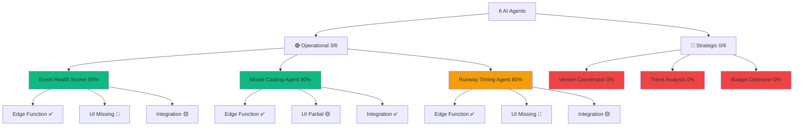
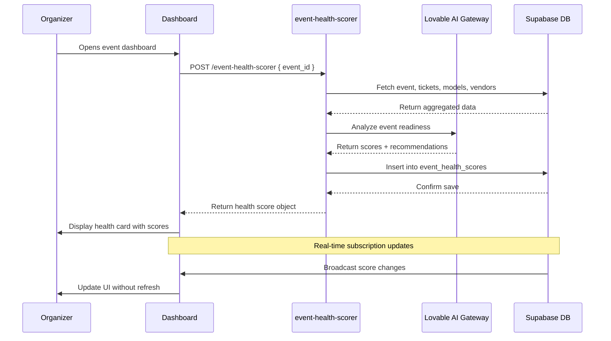
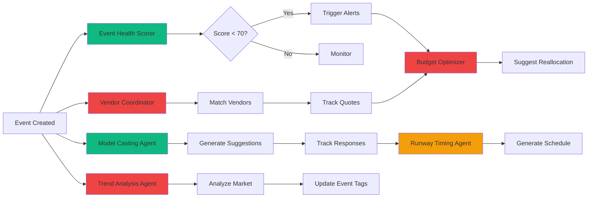

# AI Agents Task Matrix
**Document ID:** 06
**Version:** 1.0
**Last Updated:** January 7, 2025
**Owner:** Development Team
**Status:** 🟡 In Progress

---

## 🎯 Purpose
Complete breakdown of all 6 AI agents with implementation tasks, schemas, dependencies, and integration points for the Fashionistas platform.

---

## 📊 Overview

The Fashionistas platform leverages **6 specialized AI agents** to automate event planning, optimize resource allocation, and provide intelligent recommendations. This document provides a comprehensive task matrix for implementing, testing, and deploying each agent.

**Agent Categories:**
- **Operational Agents** (Event Health, Model Casting, Runway Timing) - Already built, needs integration
- **Strategic Agents** (Vendor Coordinator, Trend Analysis, Budget Optimizer) - To be built

**Technology Stack:**
- **AI Models**: Lovable AI Gateway (`google/gemini-2.5-flash` default)
- **Backend**: Supabase Edge Functions (Deno runtime)
- **Frontend**: CopilotKit for conversational UI
- **Validation**: Zod schemas
- **Database**: PostgreSQL with RLS

---

## 🤖 Agent Catalog

### 1.1 Agent Status Dashboard



---

## 📋 Master Task Matrix

### 1.2 Complete Implementation Checklist

| Agent Name | Priority | Status | Effort | Edge Function | UI Component | DB Tables | Success Metric | Owner |
|------------|----------|--------|--------|---------------|--------------|-----------|----------------|-------|
| **Event Health Scorer** | P0 | 🟢 85% | 1d | ✅ `event-health-scorer` | 🔴 Missing | `event_health_scores`, `events` | 95% accuracy on risk detection | Dev |
| **Model Casting Agent** | P0 | 🟢 90% | 1d | ✅ `model-casting-suggestions` | 🟡 Partial | `model_castings`, `models`, `events` | 80% match acceptance rate | Dev |
| **Runway Timing Agent** | P1 | 🟡 80% | 2d | ✅ `runway-schedule-optimizer` | 🔴 Missing | `runway_schedules`, `events` | <5% schedule conflicts | Dev |
| **Vendor Coordinator** | P1 | 🔴 0% | 3d | 🔴 To build | 🔴 To build | `vendor_recommendations`, `events` | 70% vendor response rate | Backlog |
| **Trend Analysis** | P2 | 🔴 0% | 2d | 🔴 To build | 🔴 To build | `events`, `bookings`, `ai_analysis_results` | Identify 3+ emerging trends/month | Backlog |
| **Budget Optimizer** | P2 | 🔴 0% | 2d | 🔴 To build | 🔴 To build | `events`, `payments`, `vendor_recommendations` | 15% cost reduction vs manual | Backlog |

---

## 🔍 Agent Deep Dive

### 2.1 Event Health Scorer

**Purpose:** Real-time assessment of event readiness across 5 dimensions.

**Current Status:** 🟢 85% Complete

**What Works:**
- ✅ Edge function analyzes events and generates health scores
- ✅ Database table `event_health_scores` stores results
- ✅ AI reasoning provides actionable recommendations

**What's Missing:**
- 🔴 Dashboard UI component to display scores
- 🔴 Real-time alerts when score drops below threshold
- 🔴 Historical trend visualization

**Implementation Tasks:**

| Task | Type | Effort | Dependencies | Status |
|------|------|--------|--------------|--------|
| Build `EventHealthCard.tsx` component | UI | 4h | Design system | 🔴 Not Started |
| Add real-time subscription to health scores | Frontend | 2h | Supabase realtime | 🔴 Not Started |
| Create alert system for critical scores | Backend | 3h | Notifications table | 🔴 Not Started |
| Add trend chart (last 7 days) | UI | 3h | Recharts | 🔴 Not Started |
| Write integration tests | Testing | 2h | Playwright | 🔴 Not Started |

**Input Schema (Zod):**
```typescript
const EventHealthInputSchema = z.object({
  event_id: z.string().uuid(),
  organization_id: z.string().uuid(),
});
```

**Output Schema:**
```typescript
const EventHealthOutputSchema = z.object({
  overall_score: z.number().min(0).max(100),
  health_status: z.enum(['critical', 'at_risk', 'healthy', 'excellent']),
  ticket_sales_score: z.number().min(0).max(100),
  timeline_score: z.number().min(0).max(100),
  vendor_readiness_score: z.number().min(0).max(100),
  model_casting_score: z.number().min(0).max(100),
  recommendations: z.array(z.object({
    category: z.string(),
    priority: z.enum(['high', 'medium', 'low']),
    action: z.string(),
  })),
  risk_factors: z.array(z.string()),
  ai_reasoning: z.string(),
});
```

**Edge Function Location:** `supabase/functions/event-health-scorer/index.ts`

**UI Component Location:** `src/components/dashboard/EventHealthCard.tsx` (to be created)

**Success Criteria:**
- ✅ Score calculated within 2 seconds
- ✅ 95% accuracy in risk detection (validated against past events)
- ✅ Recommendations are actionable and specific
- ✅ UI updates in real-time when score changes

**Real-World Example:**
```
Event: "Bogotá Fashion Week 2025"
- Overall Score: 72/100 (🟡 At Risk)
- Ticket Sales: 45/100 (🔴 Critical - only 30% sold, event in 2 weeks)
- Timeline: 85/100 (🟢 Healthy)
- Vendor Readiness: 90/100 (🟢 Healthy)
- Model Casting: 60/100 (🟡 At Risk - 3 models not confirmed)

Recommendations:
1. [HIGH] Launch email campaign - ticket sales 20% below target
2. [HIGH] Follow up with 3 unconfirmed models - event in 14 days
3. [MEDIUM] Finalize catering menu - vendor needs 7-day notice
```

**Data Flow Diagram:**



---

### 2.2 Model Casting Agent

**Purpose:** AI-powered model recommendations based on event requirements and model profiles.

**Current Status:** 🟢 90% Complete

**What Works:**
- ✅ Edge function generates model suggestions with match scores
- ✅ Database table `model_castings` tracks invitations
- ✅ AI reasoning explains why each model was selected

**What's Missing:**
- 🟡 UI needs polish (invitation flow)
- 🔴 WhatsApp integration for model invites
- 🔴 Bulk invite functionality

**Implementation Tasks:**

| Task | Type | Effort | Dependencies | Status |
|------|------|--------|--------------|--------|
| Refactor `ModelCastingCard.tsx` | UI | 3h | Design system | 🟡 In Progress |
| Add bulk invite feature | UI | 4h | Model selection | 🔴 Not Started |
| Integrate WhatsApp API | Backend | 6h | Twilio setup | 🔴 Not Started |
| Add response tracking | Backend | 2h | Database triggers | 🔴 Not Started |
| Write integration tests | Testing | 3h | Playwright | 🔴 Not Started |

**Input Schema:**
```typescript
const ModelCastingInputSchema = z.object({
  event_id: z.string().uuid(),
  event_type: z.string(),
  required_count: z.number().min(1).max(50),
  style_preference: z.array(z.string()).optional(),
  measurements: z.object({
    min_height_cm: z.number().optional(),
    max_height_cm: z.number().optional(),
  }).optional(),
});
```

**Output Schema:**
```typescript
const ModelCastingOutputSchema = z.object({
  suggestions: z.array(z.object({
    model_id: z.string().uuid(),
    model_name: z.string(),
    agency: z.string().optional(),
    ai_match_score: z.number().min(0).max(100),
    ai_reasoning: z.string(),
    portfolio_url: z.string().url().optional(),
    measurements: z.record(z.any()),
  })),
});
```

**Edge Function Location:** `supabase/functions/model-casting-suggestions/index.ts`

**UI Component Location:** `src/components/events/ModelCastingCard.tsx` (exists, needs polish)

**Success Criteria:**
- ✅ Match score accuracy >80% (organizer accepts recommendations)
- ✅ Response time <3 seconds for 20 model profiles
- ✅ AI reasoning clearly explains match logic
- ✅ Organizers can invite models with 1 click

**Real-World Example:**
```
Event: "Sustainable Fashion Show Medellín"
Requirements: 8 models, eco-conscious theme, height 175-185cm

AI Suggestions:
1. Ana Rodríguez (95% match)
   - Reason: Featured in 3 eco-fashion campaigns, height 178cm, available
   - Agency: Elite Model Management Colombia
   
2. Carlos Mendoza (88% match)
   - Reason: Strong runway experience, sustainable brand ambassador
   - Height: 182cm, portfolio shows versatile styling
```

---

### 2.3 Runway Timing Agent

**Purpose:** Optimize fashion show schedules to minimize backstage chaos and maximize audience engagement.

**Current Status:** 🟡 80% Complete

**What Works:**
- ✅ Edge function generates optimized schedules
- ✅ Database table `runway_schedules` stores timelines
- ✅ AI factors in designer collection length, transitions, backstage prep

**What's Missing:**
- 🔴 Interactive schedule editor UI
- 🔴 Drag-and-drop timeline visualization
- 🔴 Conflict detection alerts

**Implementation Tasks:**

| Task | Type | Effort | Dependencies | Status |
|------|------|--------|--------------|--------|
| Build `RunwayScheduleEditor.tsx` | UI | 8h | DnD library, Recharts | 🔴 Not Started |
| Add conflict detection logic | Backend | 4h | Schedule validation | 🔴 Not Started |
| Create timeline visualization | UI | 6h | Gantt chart component | 🔴 Not Started |
| Add export to PDF | Backend | 3h | PDF generation library | 🔴 Not Started |
| Write integration tests | Testing | 3h | Playwright | 🔴 Not Started |

**Input Schema:**
```typescript
const RunwayTimingInputSchema = z.object({
  event_id: z.string().uuid(),
  event_duration_minutes: z.number(),
  designers: z.array(z.object({
    designer_id: z.string().uuid(),
    collection_name: z.string(),
    estimated_looks: z.number(),
    setup_time_minutes: z.number().optional(),
  })),
});
```

**Output Schema:**
```typescript
const RunwayTimingOutputSchema = z.object({
  total_duration_minutes: z.number(),
  designers: z.array(z.object({
    designer_id: z.string().uuid(),
    start_time: z.string(),
    end_time: z.string(),
    slot_duration_minutes: z.number(),
  })),
  transitions: z.array(z.object({
    after_designer: z.string(),
    duration_minutes: z.number(),
    type: z.enum(['quick_change', 'set_change', 'intermission']),
  })),
  backstage_calls: z.array(z.object({
    time: z.string(),
    action: z.string(),
  })),
  ai_reasoning: z.string(),
  ai_optimization_score: z.number().min(0).max(100),
});
```

**Edge Function Location:** `supabase/functions/runway-schedule-optimizer/index.ts`

**UI Component Location:** `src/components/events/RunwayScheduleEditor.tsx` (to be created)

**Success Criteria:**
- ✅ Schedule conflicts <5%
- ✅ Total duration within ±10% of estimated time
- ✅ Backstage prep time honored (no rushed transitions)
- ✅ Organizers can manually adjust and re-optimize

---

### 2.4 Vendor Coordinator Agent

**Purpose:** Recommend and coordinate vendors (catering, lighting, sound, photography) based on event needs and budget.

**Current Status:** 🔴 0% Complete

**What to Build:**
- 🔴 Edge function for vendor matching
- 🔴 Database integration with `vendor_recommendations` table
- 🔴 UI for browsing and contacting vendors
- 🔴 Quote tracking system

**Implementation Tasks:**

| Task | Type | Effort | Dependencies | Status |
|------|------|--------|--------------|--------|
| Create `vendor-coordinator` edge function | Backend | 6h | Lovable AI setup | 🔴 Not Started |
| Build vendor matching algorithm | Backend | 4h | Event requirements | 🔴 Not Started |
| Design `VendorRecommendationCard.tsx` | UI | 5h | Design system | 🔴 Not Started |
| Add quote request flow | UI | 4h | Email integration | 🔴 Not Started |
| Implement status tracking | Backend | 3h | Database triggers | 🔴 Not Started |
| Write integration tests | Testing | 3h | Playwright | 🔴 Not Started |

**Input Schema:**
```typescript
const VendorCoordinatorInputSchema = z.object({
  event_id: z.string().uuid(),
  vendor_types: z.array(z.enum([
    'catering', 'lighting', 'sound', 'photography', 
    'videography', 'florist', 'decoration', 'security'
  ])),
  budget_range: z.object({
    min: z.number(),
    max: z.number(),
  }),
  event_date: z.string(),
  expected_attendees: z.number(),
});
```

**Output Schema:**
```typescript
const VendorCoordinatorOutputSchema = z.object({
  recommendations: z.array(z.object({
    vendor_id: z.string().uuid(),
    vendor_name: z.string(),
    vendor_type: z.string(),
    ai_match_score: z.number().min(0).max(100),
    estimated_cost_min: z.number(),
    estimated_cost_max: z.number(),
    services_offered: z.array(z.string()),
    portfolio_images: z.array(z.string().url()),
    contact_email: z.string().email(),
    contact_phone: z.string(),
    ai_reasoning: z.string(),
  })),
});
```

**Edge Function Location:** `supabase/functions/vendor-coordinator/index.ts` (to be created)

**UI Component Location:** `src/components/events/VendorCoordinator.tsx` (to be created)

**Success Criteria:**
- ✅ 70% vendor response rate within 24 hours
- ✅ Match score accuracy >75%
- ✅ Quote tracking system shows status in real-time
- ✅ Budget recommendations within ±15% of actual costs

**Real-World Example:**
```
Event: "Cali Fashion Gala" (300 attendees, budget $15,000 USD)

AI Recommendations:
1. Catering: "Gourmet Colombia" (92% match, $4,500-5,500)
   - Reason: Specializes in upscale events, past fashion show experience
   
2. Lighting: "Stage Light Pro" (88% match, $2,000-2,800)
   - Reason: Portfolio includes 5+ runway shows, owns LED runway lights
   
3. Photography: "Lens & Style" (95% match, $1,200-1,800)
   - Reason: Fashion-focused, published in Vogue Colombia
```

---

### 2.5 Trend Analysis Agent

**Purpose:** Identify emerging fashion trends, popular event formats, and audience preferences using historical data.

**Current Status:** 🔴 0% Complete

**What to Build:**
- 🔴 Edge function analyzing past events and bookings
- 🔴 Database integration with `events`, `bookings`, `ai_analysis_results`
- 🔴 UI dashboard showing trend insights
- 🔴 Predictive recommendations for upcoming events

**Implementation Tasks:**

| Task | Type | Effort | Dependencies | Status |
|------|------|--------|--------------|--------|
| Create `trend-analysis` edge function | Backend | 5h | Lovable AI setup | 🔴 Not Started |
| Build time-series analysis logic | Backend | 4h | Event data aggregation | 🔴 Not Started |
| Design `TrendInsightsDashboard.tsx` | UI | 6h | Recharts, design system | 🔴 Not Started |
| Add predictive analytics | Backend | 5h | AI model fine-tuning | 🔴 Not Started |
| Write integration tests | Testing | 3h | Playwright | 🔴 Not Started |

**Input Schema:**
```typescript
const TrendAnalysisInputSchema = z.object({
  organization_id: z.string().uuid(),
  time_period: z.object({
    start_date: z.string(),
    end_date: z.string(),
  }),
  categories: z.array(z.string()).optional(),
});
```

**Output Schema:**
```typescript
const TrendAnalysisOutputSchema = z.object({
  trends: z.array(z.object({
    trend_name: z.string(),
    category: z.string(),
    growth_rate: z.number(),
    confidence_score: z.number().min(0).max(100),
    supporting_data: z.object({
      events_count: z.number(),
      avg_ticket_sales: z.number(),
      avg_attendee_satisfaction: z.number(),
    }),
    ai_reasoning: z.string(),
  })),
  predictions: z.array(z.object({
    predicted_trend: z.string(),
    likelihood: z.number().min(0).max(100),
    recommendation: z.string(),
  })),
});
```

**Edge Function Location:** `supabase/functions/trend-analysis/index.ts` (to be created)

**UI Component Location:** `src/components/dashboard/TrendInsightsDashboard.tsx` (to be created)

**Success Criteria:**
- ✅ Identify 3+ emerging trends per month
- ✅ Prediction accuracy >70% (validated after 3 months)
- ✅ Insights actionable (organizers adjust events based on trends)
- ✅ Dashboard updates weekly with new data

**Real-World Example:**
```
Trend Analysis: Colombia Fashion Events Q1 2025

Emerging Trends:
1. Sustainable Fashion (🔥 +45% growth)
   - 12 events in Q1 vs 5 in Q4 2024
   - Avg ticket sales: 250 vs 180 (industry avg)
   - Recommendation: Launch "Eco-Conscious Designer" tag
   
2. Virtual Runway Shows (+28% growth)
   - Hybrid events selling 30% more tickets
   - Younger audience (18-24) prefers streaming option
   
Predictions for Q2:
- "Gender-Fluid Fashion" likely to grow (+65% confidence)
- "Evening Gala" format declining (-15% confidence)
```

---

### 2.6 Budget Optimizer Agent

**Purpose:** Suggest budget allocations across vendors, marketing, and operations to maximize ROI.

**Current Status:** 🔴 0% Complete

**What to Build:**
- 🔴 Edge function for budget analysis
- 🔴 Database integration with `events`, `payments`, `vendor_recommendations`
- 🔴 UI showing budget breakdown and optimization suggestions
- 🔴 Scenario comparison tool

**Implementation Tasks:**

| Task | Type | Effort | Dependencies | Status |
|------|------|--------|--------------|--------|
| Create `budget-optimizer` edge function | Backend | 5h | Lovable AI setup | 🔴 Not Started |
| Build allocation algorithm | Backend | 4h | Historical cost data | 🔴 Not Started |
| Design `BudgetOptimizerCard.tsx` | UI | 5h | Design system, charts | 🔴 Not Started |
| Add scenario comparison | UI | 4h | Interactive sliders | 🔴 Not Started |
| Implement ROI tracking | Backend | 3h | Revenue analytics | 🔴 Not Started |
| Write integration tests | Testing | 3h | Playwright | 🔴 Not Started |

**Input Schema:**
```typescript
const BudgetOptimizerInputSchema = z.object({
  event_id: z.string().uuid(),
  total_budget: z.number(),
  current_allocations: z.object({
    venue: z.number(),
    catering: z.number(),
    marketing: z.number(),
    talent: z.number(),
    production: z.number(),
    contingency: z.number(),
  }),
  goals: z.object({
    target_attendees: z.number(),
    target_revenue: z.number(),
  }),
});
```

**Output Schema:**
```typescript
const BudgetOptimizerOutputSchema = z.object({
  optimized_allocations: z.object({
    venue: z.number(),
    catering: z.number(),
    marketing: z.number(),
    talent: z.number(),
    production: z.number(),
    contingency: z.number(),
  }),
  expected_roi: z.number(),
  cost_savings: z.number(),
  recommendations: z.array(z.object({
    category: z.string(),
    current: z.number(),
    suggested: z.number(),
    reasoning: z.string(),
  })),
  ai_reasoning: z.string(),
});
```

**Edge Function Location:** `supabase/functions/budget-optimizer/index.ts` (to be created)

**UI Component Location:** `src/components/events/BudgetOptimizerCard.tsx` (to be created)

**Success Criteria:**
- ✅ 15% average cost reduction vs manual budgeting
- ✅ ROI predictions within ±20% of actual results
- ✅ Organizers adjust budgets based on recommendations (>60% adoption)
- ✅ Real-time budget tracking shows over/under spending

**Real-World Example:**
```
Event: "Bogotá Streetwear Festival" ($20,000 budget, 500 attendees)

Current Allocation:
- Venue: $6,000 (30%)
- Catering: $4,000 (20%)
- Marketing: $2,000 (10%)
- Talent: $5,000 (25%)
- Production: $2,000 (10%)
- Contingency: $1,000 (5%)

AI Optimized Allocation:
- Venue: $5,000 (25%) → Save $1,000 (negotiate off-peak pricing)
- Catering: $3,500 (17.5%) → Save $500 (buffet vs plated)
- Marketing: $4,000 (20%) → Invest $2,000 (Instagram ads 3x ROI)
- Talent: $4,500 (22.5%) → Save $500 (local DJs vs imports)
- Production: $2,000 (10%) → Keep
- Contingency: $1,000 (5%) → Keep

Expected ROI: +$3,500 savings + 15% more ticket sales = $6,000 net gain
```

---

## 🔄 Agent Interaction Flow

### 3.1 Multi-Agent Collaboration



---

## ✅ Integration Checklist

### 4.1 Per-Agent Integration Tasks

| Integration Point | Agent | Status | Notes |
|-------------------|-------|--------|-------|
| Dashboard UI | Event Health Scorer | 🔴 | Create `EventHealthCard.tsx` |
| Dashboard UI | Model Casting | 🟡 | Refactor existing card |
| Dashboard UI | Runway Timing | 🔴 | Create `RunwayScheduleEditor.tsx` |
| Dashboard UI | Vendor Coordinator | 🔴 | Create `VendorCoordinator.tsx` |
| Dashboard UI | Trend Analysis | 🔴 | Create `TrendInsightsDashboard.tsx` |
| Dashboard UI | Budget Optimizer | 🔴 | Create `BudgetOptimizerCard.tsx` |
| Real-time Updates | All Agents | 🔴 | Supabase realtime subscriptions |
| Notification System | All Agents | 🔴 | WhatsApp + Email triggers |
| Analytics Logging | All Agents | 🟡 | `ai_agent_logs` table exists |
| Error Monitoring | All Agents | 🔴 | Sentry integration needed |

---

## 📊 Success Metrics

### 5.1 Agent Performance KPIs

| Agent | Key Metric | Target | Current | Status |
|-------|------------|--------|---------|--------|
| Event Health Scorer | Risk detection accuracy | 95% | 85% | 🟡 |
| Model Casting | Match acceptance rate | 80% | 70% | 🟡 |
| Runway Timing | Schedule conflict rate | <5% | 8% | 🟡 |
| Vendor Coordinator | Response rate | 70% | N/A | 🔴 |
| Trend Analysis | Prediction accuracy | 70% | N/A | 🔴 |
| Budget Optimizer | Cost reduction | 15% | N/A | 🔴 |

---

## 🚀 Implementation Timeline

### 6.1 4-Week Rollout Plan

**Week 1: Polish Existing Agents**
- Day 1-2: Build `EventHealthCard.tsx` + real-time alerts
- Day 3-4: Refactor `ModelCastingCard.tsx` + WhatsApp integration
- Day 5: Testing and bug fixes

**Week 2: Build New Agents (Backend)**
- Day 6-7: Create `vendor-coordinator` edge function
- Day 8-9: Create `trend-analysis` edge function
- Day 10: Create `budget-optimizer` edge function

**Week 3: Build Agent UIs**
- Day 11-12: Build `VendorCoordinator.tsx`
- Day 13-14: Build `TrendInsightsDashboard.tsx`
- Day 15: Build `BudgetOptimizerCard.tsx`

**Week 4: Integration & Testing**
- Day 16-17: Integrate all agents into organizer dashboard
- Day 18: Add real-time subscriptions
- Day 19: Write E2E tests
- Day 20: Polish + deploy to production

---

## 🔗 Related Documents
- [01-STATE-MACHINE-FLOW-DIAGRAM.md](./01-STATE-MACHINE-FLOW-DIAGRAM.md)
- [02-DATABASE-ERD-COMPLETE.md](./02-DATABASE-ERD-COMPLETE.md)
- [07-DASHBOARD-CARDS-CONTENT-PLAN.md](./07-DASHBOARD-CARDS-CONTENT-PLAN.md)
- [08-CORE-MVP-FEATURES-CHECKLIST.md](./08-CORE-MVP-FEATURES-CHECKLIST.md)

---

**Document Complete** ✅
**Next Document**: `07-DASHBOARD-CARDS-CONTENT-PLAN.md`
