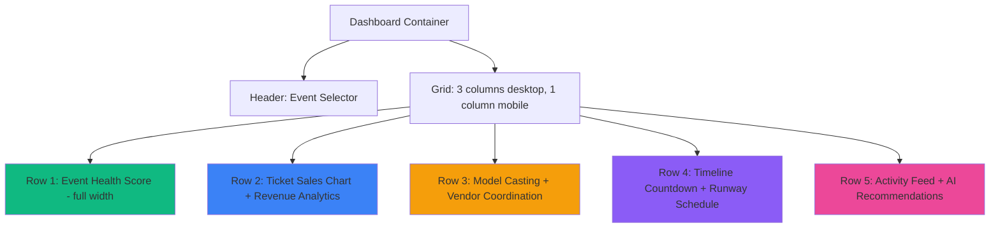
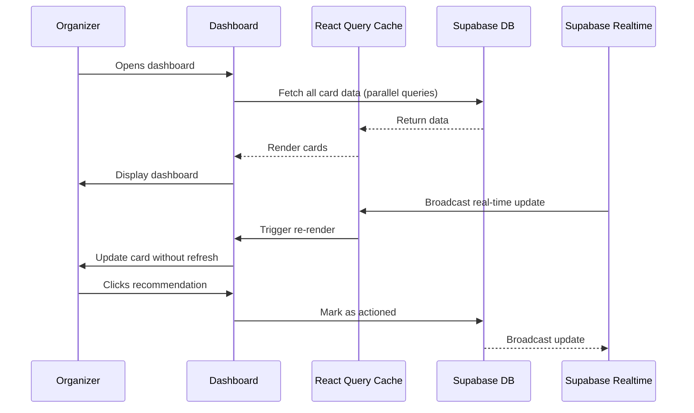

# Dashboard Cards Content Plan
**Document ID:** 07
**Version:** 1.0
**Last Updated:** January 7, 2025
**Owner:** Development Team
**Status:** 🟡 In Progress

---

## 🎯 Purpose
Detailed specification for all dashboard cards, data visualizations, and real-time metrics displayed to event organizers on the Fashionistas platform.

---

## 📊 Overview

The **Organizer Dashboard** serves as the command center for managing fashion events. It displays 9 core cards with real-time data, AI-powered insights, and actionable metrics.

**Dashboard Goals:**
- Provide at-a-glance event health status
- Surface critical actions requiring attention
- Show revenue and ticket sales trends
- Display AI recommendations proactively
- Enable quick access to detailed views

**Technical Stack:**
- **Charts**: Recharts (area, line, bar, pie charts)
- **Real-time**: Supabase subscriptions
- **Responsiveness**: Mobile-first grid layout (1 column mobile, 2-3 desktop)
- **Themes**: Dark/light mode support via CSS variables

---

## 🎴 Card Catalog

### 1. Event Health Score Card

**Priority:** P0 (Critical)
**Status:** 🔴 Not Implemented
**Effort:** 6 hours

**Visual Design:**
- Large circular progress indicator (0-100 score)
- Color-coded: 🔴 <50, 🟡 50-75, 🟢 >75
- 4 sub-scores (tickets, timeline, vendors, models)
- Top 3 recommendations list

**Data Source:**
```sql
SELECT * FROM event_health_scores 
WHERE event_id = $1 
ORDER BY created_at DESC LIMIT 1
```

**Real-time Updates:** Yes (Supabase realtime on `event_health_scores` table)

**Component Path:** `src/components/dashboard/EventHealthCard.tsx`

**Props:**
```typescript
interface EventHealthCardProps {
  eventId: string;
  onRecommendationClick?: (recommendation: string) => void;
}
```

**Mock Data:**
```json
{
  "overall_score": 72,
  "health_status": "at_risk",
  "ticket_sales_score": 45,
  "timeline_score": 85,
  "vendor_readiness_score": 90,
  "model_casting_score": 60,
  "recommendations": [
    {
      "category": "ticket_sales",
      "priority": "high",
      "action": "Launch email campaign - sales 20% below target"
    }
  ]
}
```

---

### 2. Ticket Sales Chart

**Priority:** P0 (Critical)
**Status:** 🟡 50% Implemented
**Effort:** 4 hours

**Visual Design:**
- Area chart showing daily sales over time
- Target line (dotted) vs actual sales (solid)
- Total sold / Total capacity displayed
- Sell-through percentage

**Data Source:**
```sql
SELECT DATE(created_at) as day, COUNT(*) as tickets_sold
FROM bookings
WHERE event_id = $1 AND status = 'confirmed'
GROUP BY day
ORDER BY day ASC
```

**Chart Type:** Recharts `<AreaChart>` with gradient fill

**Component Path:** `src/components/dashboard/TicketSalesChart.tsx`

**Props:**
```typescript
interface TicketSalesChartProps {
  eventId: string;
  targetSales: number;
  timeRange?: '7d' | '30d' | 'all';
}
```

---

### 3. Model Casting Status

**Priority:** P0 (Critical)
**Status:** 🟢 75% Implemented
**Effort:** 3 hours

**Visual Design:**
- Horizontal bar showing: Invited | Confirmed | Rejected
- Avatar list of confirmed models
- "Invite More" action button
- Status breakdown (pie chart)

**Data Source:**
```sql
SELECT status, COUNT(*) as count
FROM model_castings
WHERE event_id = $1
GROUP BY status
```

**Component Path:** `src/components/dashboard/ModelCastingStatus.tsx`

---

### 4. Vendor Coordination

**Priority:** P1 (High)
**Status:** 🔴 Not Implemented
**Effort:** 5 hours

**Visual Design:**
- List of vendor categories (catering, lighting, etc.)
- Status per vendor: Contacted | Quote Received | Confirmed
- AI match scores displayed
- Quick contact buttons

**Data Source:**
```sql
SELECT vendor_type, status, COUNT(*) as count
FROM vendor_recommendations
WHERE event_id = $1
GROUP BY vendor_type, status
```

**Component Path:** `src/components/dashboard/VendorCoordinationCard.tsx`

---

### 5. Revenue Analytics

**Priority:** P0 (Critical)
**Status:** 🔴 Not Implemented
**Effort:** 6 hours

**Visual Design:**
- Total revenue (gross/net)
- Payment method breakdown (pie chart)
- Revenue trend (last 30 days)
- Refund rate indicator

**Data Source:**
```sql
SELECT 
  SUM(amount_cents) as gross_revenue,
  payment_method,
  DATE(created_at) as day
FROM payments
WHERE booking_id IN (
  SELECT id FROM bookings WHERE event_id = $1
)
GROUP BY payment_method, day
```

**Chart Type:** Combined bar + line chart (Recharts `<ComposedChart>`)

**Component Path:** `src/components/dashboard/RevenueAnalyticsCard.tsx`

---

### 6. Timeline Countdown

**Priority:** P1 (High)
**Status:** 🟡 60% Implemented
**Effort:** 2 hours

**Visual Design:**
- Large countdown: "X days until event"
- Key milestones with progress indicators
- Overdue tasks highlighted in red

**Data Source:**
```sql
SELECT start_datetime, end_datetime FROM events WHERE id = $1
```

**Component Path:** `src/components/dashboard/TimelineCountdown.tsx`

---

### 7. Runway Schedule Preview

**Priority:** P2 (Medium)
**Status:** 🔴 Not Implemented
**Effort:** 4 hours

**Visual Design:**
- Gantt-style timeline (horizontal bars)
- Designer slots with transition gaps
- Click to edit schedule
- Conflict warnings (overlaps highlighted)

**Data Source:**
```sql
SELECT * FROM runway_schedules WHERE event_id = $1
```

**Chart Type:** Custom Gantt chart (HTML divs with flexbox)

**Component Path:** `src/components/dashboard/RunwaySchedulePreview.tsx`

---

### 8. Recent Activity Feed

**Priority:** P2 (Medium)
**Status:** 🔴 Not Implemented
**Effort:** 3 hours

**Visual Design:**
- Chronological list of recent events
- Icons per activity type (ticket sold, model confirmed, etc.)
- Timestamps (relative: "2 hours ago")

**Data Source:**
```sql
SELECT * FROM audit_logs 
WHERE organization_id = $1
ORDER BY created_at DESC
LIMIT 20
```

**Component Path:** `src/components/dashboard/ActivityFeed.tsx`

---

### 9. AI Recommendations Panel

**Priority:** P1 (High)
**Status:** 🔴 Not Implemented
**Effort:** 4 hours

**Visual Design:**
- Card carousel with AI suggestions
- Action buttons per recommendation
- Dismissible cards
- Refresh button for new suggestions

**Data Source:**
```sql
SELECT * FROM ai_recommendations
WHERE profile_id = $1
ORDER BY score DESC
LIMIT 5
```

**Component Path:** `src/components/dashboard/AIRecommendationsPanel.tsx`

---

## 📐 Dashboard Layout Grid



---

## 📊 Data Flow Architecture



---

## ✅ Success Criteria

- All 9 cards load in <2 seconds
- Real-time updates appear within 1 second
- Mobile responsive (Lighthouse score >90)
- Zero layout shift (CLS <0.1)
- Dark/light mode support
- Accessibility (WCAG 2.1 AA)

---

## 🔗 Related Documents
- [06-AI-AGENTS-TASK-MATRIX.md](./06-AI-AGENTS-TASK-MATRIX.md)
- [08-CORE-MVP-FEATURES-CHECKLIST.md](./08-CORE-MVP-FEATURES-CHECKLIST.md)

---

**Document Complete** ✅
