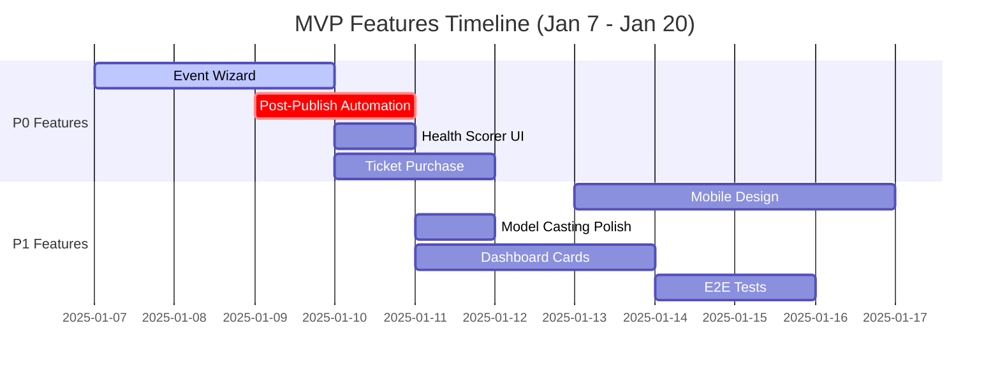

# Core MVP Features Checklist
**Document ID:** 08
**Version:** 1.0
**Last Updated:** January 7, 2025
**Owner:** Development Team
**Status:** 🔴 In Progress

---

## 🎯 Purpose
Must-have features for production launch of Fashionistas Event Platform - Week 1-2 implementation roadmap.

---

## 📊 MVP Scope

**Launch Target:** January 20, 2025 (14 days)
**Production Readiness:** 60% → 95%
**Critical Blockers:** 4 features

---

## 🔴 P0 Features (Must-Have - Blocking)

| Feature | Status | Effort | Owner | ETA | Dependencies |
|---------|--------|--------|-------|-----|--------------|
| Event Wizard (CopilotKit) | 🟡 75% | 3d | Dev | Jan 8 | None |
| Post-Publish Automation | 🔴 0% | 2d | Dev | Jan 9 | Wizard |
| Event Health Scorer Integration | 🟡 85% | 1d | Dev | Jan 10 | Dashboard UI |
| Ticket Purchase Flow | 🟡 60% | 2d | Dev | Jan 10 | Stripe |

**Total P0 Effort:** 8 days

---

## 🟡 P1 Features (High Priority)

| Feature | Status | Effort | Owner | ETA | Dependencies |
|---------|--------|--------|-------|-----|--------------|
| Mobile-First Design | 🔴 15% | 4d | Design | Jan 15 | Design system |
| Model Casting UI Polish | 🟡 75% | 1d | Dev | Jan 11 | None |
| Dashboard Cards | 🟡 40% | 3d | Dev | Jan 13 | Real-time setup |
| E2E Testing Suite | 🔴 0% | 2d | QA | Jan 14 | Playwright |

**Total P1 Effort:** 10 days

---

## 🟢 P2 Features (Nice-to-Have)

| Feature | Status | Effort | Owner | ETA | Dependencies |
|---------|--------|--------|-------|-----|--------------|
| Spanish i18n | 🔴 0% | 1d | Dev | Jan 16 | None |
| Email Notifications | 🔴 0% | 2d | Dev | Jan 17 | SendGrid |
| Analytics Dashboard | 🔴 0% | 2d | Dev | Jan 18 | Charts |

---

## 📋 Detailed Task Breakdown

### 1. Event Wizard (CopilotKit State Machine)

**Current Status:** 🟡 75% Complete

**What Works:**
- ✅ All 6 stage hooks implemented
- ✅ Zustand state management with autosave
- ✅ Zod validation per stage
- ✅ useCopilotReadable exposes state to AI

**What's Blocking:**
- 🔴 Manual navigation (switch statement) still exists
- 🔴 Stage guardrails not implemented
- 🔴 Error messages not localized

**Tasks:**
1. Remove manual `switch(stage)` from EventWizard.tsx (2h)
2. Add stage guardrails to copilotkit edge function (3h)
3. Verify all transitions AI-driven (1h)
4. Add structured logging (1h)
5. Test invalid transitions (2h)

**Acceptance Criteria:**
- AI drives all stage transitions (no Next/Back buttons)
- Invalid transitions blocked with clear errors
- Logs show userId, from→to, latency for every transition

---

### 2. Post-Publish Automation

**Current Status:** 🔴 0% Complete (CRITICAL BLOCKER)

**Required Components:**
- 🔴 Edge function: `event-publish` (creates event + tickets)
- 🔴 Landing page: `/event/[slug]` (public event view)
- 🔴 Notification triggers (WhatsApp/email stubs)
- 🔴 AI health score initialization

**Tasks:**
1. Create `supabase/functions/event-publish/index.ts` (6h)
2. Update `06-use-stage-review-publish.tsx` to call function (2h)
3. Build `src/pages/PublicEventLanding.tsx` (4h)
4. Add notification stubs (2h)
5. Trigger health score on publish (1h)
6. Write integration test (1h)

**Acceptance Criteria:**
- Completing wizard creates event row in database
- Event landing page accessible at `/event/[slug]`
- Organizer receives confirmation (email/WhatsApp stub)
- Health score calculated within 30 seconds

---

### 3. Event Health Scorer Integration

**Current Status:** 🟡 85% Complete

**What Works:**
- ✅ Edge function analyzes events
- ✅ Database stores scores
- ✅ AI reasoning generated

**What's Missing:**
- 🔴 Dashboard card UI
- 🔴 Real-time alerts
- 🔴 Historical trend chart

**Tasks:**
1. Build `EventHealthCard.tsx` component (4h)
2. Add real-time subscription (2h)
3. Create alert system for critical scores (3h)
4. Add 7-day trend chart (3h)
5. Write integration test (2h)

**Acceptance Criteria:**
- Dashboard displays live health score
- Alerts triggered when score drops below 50
- Chart shows score trend over time

---

### 4. Ticket Purchase Flow (Stripe)

**Current Status:** 🟡 60% Complete

**What Works:**
- ✅ Stripe checkout session created
- ✅ Payment intent stored

**What's Missing:**
- 🔴 Webhook handler for payment confirmation
- 🔴 QR code generation for tickets
- 🔴 Email ticket delivery

**Tasks:**
1. Create Stripe webhook handler (4h)
2. Implement QR code generation (3h)
3. Build ticket PDF template (3h)
4. Add email delivery (2h)
5. Test payment flow end-to-end (4h)

**Acceptance Criteria:**
- User receives ticket with QR code via email
- Webhook updates booking status to "confirmed"
- Failed payments show clear error message

---

### 5. Mobile-First Design Refactor

**Current Status:** 🔴 15% Complete

**Problem Areas:**
- Wizard stages not optimized for 375px viewport
- Dashboard cards overflow on mobile
- CopilotKit sidebar overlaps content

**Tasks:**
1. Audit all components on 375px viewport (4h)
2. Refactor wizard stages for mobile (8h)
3. Optimize dashboard grid layout (6h)
4. Test on real devices (iOS/Android) (4h)
5. Lighthouse mobile audit (2h)

**Acceptance Criteria:**
- Lighthouse mobile score >90
- No horizontal scroll on any page
- Touch targets >44px
- Readable text without zoom

---

## 📊 Progress Tracker

---

## ✅ Release Gate Checklist

**Must be GREEN to deploy to production:**

- [ ] All P0 features 100% complete
- [ ] Zero critical bugs in staging
- [ ] 5 E2E tests passing (wizard, publish, purchase, mobile, health)
- [ ] Lighthouse scores: Performance >90, Accessibility >95
- [ ] Database RLS policies reviewed (no exposed data)
- [ ] Error monitoring active (Sentry)
- [ ] Staging environment matches production
- [ ] Rollback plan documented
- [ ] Post-launch monitoring dashboard configured
- [ ] Team trained on support workflows

---

## 🔗 Related Documents
- [01-STATE-MACHINE-FLOW-DIAGRAM.md](./01-STATE-MACHINE-FLOW-DIAGRAM.md)
- [10-PRODUCTION-PROGRESS-TRACKER.md](./10-PRODUCTION-PROGRESS-TRACKER.md)

---

**Document Complete** ✅
