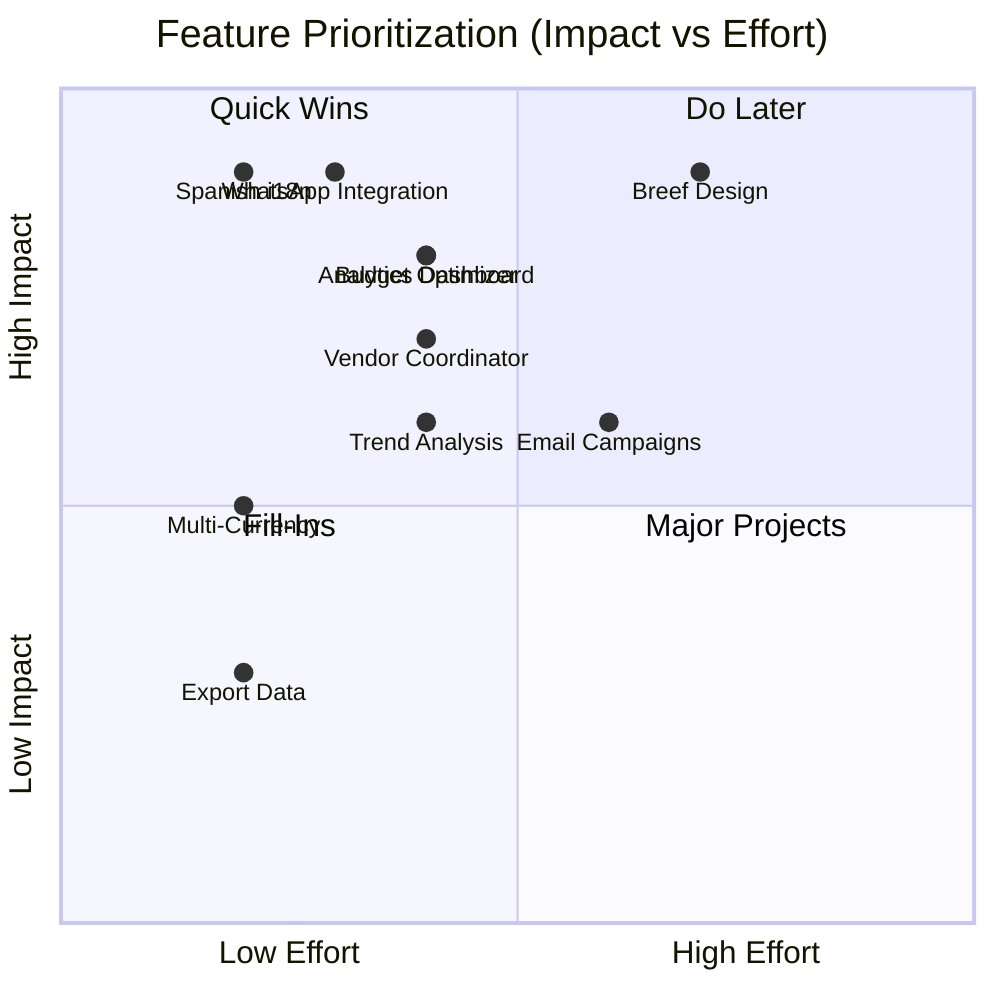

# Advanced Features Roadmap
**Document ID:** 09
**Version:** 1.0
**Last Updated:** January 7, 2025
**Owner:** Product Team
**Status:** 🟡 Planning

---

## 🎯 Purpose
Nice-to-have features for post-MVP launch (Week 3-4) to enhance competitiveness and user experience.

---

## 📊 Post-Launch Roadmap (Weeks 3-4)

**Timeline:** January 21 - February 4, 2025
**Focus:** Automation, AI enhancements, UX polish

---

## 🚀 Advanced Features Catalog

### 1. WhatsApp Integration

**Priority:** P1 (High)
**Status:** 🔴 0% Complete
**Effort:** 3 days
**Business Impact:** High (Colombian market preference)

**Scope:**
- Model invitation via WhatsApp
- Ticket delivery via WhatsApp
- Event reminders (24h, 1h before)
- Organizer notifications (new booking, low sales alert)

**Technical Requirements:**
- Twilio Business API account
- WhatsApp Business verification
- Template message approval
- Edge function for message sending

**Tasks:**
1. Set up Twilio account + WhatsApp Business (4h)
2. Create message templates (2h)
3. Build `whatsapp-send` edge function (6h)
4. Integrate with model casting flow (4h)
5. Add to ticket purchase confirmation (3h)
6. Test delivery rates (2h)

**Success Criteria:**
- >95% message delivery rate
- <30 second delivery time
- User opt-in flow compliant
- Cost <$0.05 per message

---

### 2. Vendor Coordinator Agent

**Priority:** P1 (High)
**Status:** 🔴 0% Complete
**Effort:** 2 days
**Business Impact:** Medium (reduces manual coordination)

**Scope:**
- AI-powered vendor matching
- Quote request automation
- Status tracking dashboard
- Budget allocation suggestions

**Tasks:**
1. Create `vendor-coordinator` edge function (6h)
2. Build vendor database (scraped from web) (4h)
3. Design `VendorCoordinator.tsx` UI (5h)
4. Add quote tracking workflow (3h)
5. Write integration tests (2h)

**Success Criteria:**
- 70% vendor response rate within 24h
- Match score accuracy >75%
- Organizers save 3+ hours per event

---

### 3. Trend Analysis Agent

**Priority:** P2 (Medium)
**Status:** 🔴 0% Complete
**Effort:** 2 days
**Business Impact:** Medium (competitive intelligence)

**Scope:**
- Analyze past events for emerging trends
- Predict popular event formats
- Audience preference insights
- Seasonal trend forecasting

**Tasks:**
1. Create `trend-analysis` edge function (5h)
2. Build time-series analysis logic (4h)
3. Design `TrendInsightsDashboard.tsx` (6h)
4. Add predictive analytics (5h)
5. Write integration tests (2h)

**Success Criteria:**
- Identify 3+ trends per month
- Prediction accuracy >70%
- Organizers adjust events based on insights (>50% adoption)

---

### 4. Budget Optimizer Agent

**Priority:** P2 (Medium)
**Status:** 🔴 0% Complete
**Effort:** 2 days
**Business Impact:** High (cost savings)

**Scope:**
- Budget allocation recommendations
- Cost comparison vs industry benchmarks
- ROI predictions
- Scenario comparison tool

**Tasks:**
1. Create `budget-optimizer` edge function (5h)
2. Build allocation algorithm (4h)
3. Design `BudgetOptimizerCard.tsx` (5h)
4. Add scenario comparison UI (4h)
5. Write integration tests (2h)

**Success Criteria:**
- 15% average cost reduction
- ROI predictions within ±20%
- >60% organizer adoption

---

### 5. Breef-Inspired Design System

**Priority:** P1 (High)
**Status:** 🔴 0% Complete
**Effort:** 5 days
**Business Impact:** High (brand differentiation)

**Scope:**
- Colombian fashion aesthetic (vibrant, modern)
- Custom color palette (inspired by Breef.co)
- Typography system (Montserrat + Playfair Display)
- Animation library (micro-interactions)
- Component variants (buttons, cards, forms)

**Tasks:**
1. Design audit + mood board (4h)
2. Define color palette in index.css (3h)
3. Update tailwind.config.ts (2h)
4. Create button variants (4h)
5. Refactor cards with new design (8h)
6. Add animations (6h)
7. Update all pages (16h)

**Success Criteria:**
- 100% components follow design system
- No direct color usage (all semantic tokens)
- Lighthouse accessibility score >95
- User feedback: "Looks premium"

---

### 6. Spanish Language Default

**Priority:** P1 (High)
**Status:** 🔴 0% Complete
**Effort:** 1 day
**Business Impact:** High (Colombian market)

**Scope:**
- Default locale: es-CO
- All UI strings translated
- Date/number formatting (DD/MM/YYYY, COP)
- AI prompts in Spanish
- Error messages in Spanish

**Tasks:**
1. Set up i18next (2h)
2. Extract all strings to JSON (3h)
3. Translate to Spanish (4h)
4. Update AI prompts (2h)
5. Test language switching (1h)

**Success Criteria:**
- 100% UI translated
- AI responds in Spanish
- No mixed language elements

---

### 7. Multi-Currency Support

**Priority:** P2 (Medium)
**Status:** 🔴 0% Complete
**Effort:** 1 day
**Business Impact:** Medium (international events)

**Scope:**
- Support COP and USD
- Real-time exchange rates
- Currency selector in wizard
- Payment processing in both currencies

**Tasks:**
1. Add currency field to events table (1h)
2. Integrate exchange rate API (3h)
3. Update Stripe integration (4h)
4. Add currency selector UI (2h)
5. Test dual-currency payments (2h)

---

### 8. Export Event Data

**Priority:** P2 (Low)
**Status:** 🔴 0% Complete
**Effort:** 1 day
**Business Impact:** Low (organizer convenience)

**Scope:**
- Export attendee list (CSV)
- Export event summary (PDF)
- Export financial report (Excel)

**Tasks:**
1. Build PDF generator (6h)
2. Add CSV export (2h)
3. Create Excel template (4h)
4. Add export buttons to dashboard (2h)

---

### 9. Email Campaign Builder

**Priority:** P2 (Medium)
**Status:** 🔴 0% Complete
**Effort:** 3 days
**Business Impact:** Medium (marketing automation)

**Scope:**
- Drag-and-drop email builder
- Segment attendees (VIP, general, etc.)
- Send bulk emails
- Track open/click rates

**Tasks:**
1. Integrate email template library (6h)
2. Build campaign builder UI (8h)
3. Add segmentation logic (4h)
4. Implement SendGrid integration (4h)
5. Create analytics dashboard (6h)

---

### 10. Analytics Dashboard (Organizer Insights)

**Priority:** P1 (High)
**Status:** 🔴 0% Complete
**Effort:** 2 days
**Business Impact:** High (data-driven decisions)

**Scope:**
- Ticket sales funnel
- Demographic breakdowns
- Traffic sources
- Conversion rates
- Benchmarking vs similar events

**Tasks:**
1. Design analytics schema (3h)
2. Build data aggregation queries (4h)
3. Create charts (Recharts) (6h)
4. Add export functionality (3h)
5. Write documentation (2h)

---

## 📊 Feature Prioritization Matrix

---

## 🗓️ Implementation Timeline

**Week 3 (Jan 21-27):**
- WhatsApp Integration (3d)
- Spanish i18n (1d)
- Multi-Currency (1d)

**Week 4 (Jan 28 - Feb 4):**
- Breef Design System (5d)
- Vendor Coordinator Agent (2d)

**Week 5 (Feb 5-11) - Post-Launch:**
- Budget Optimizer (2d)
- Trend Analysis (2d)
- Analytics Dashboard (2d)

---

## ✅ Success Metrics (Post-Advanced Features)

| Metric | Before | After | Target |
|--------|--------|-------|--------|
| User Engagement | 60% | 85% | >80% |
| Event Creation Time | 12 min | 8 min | <10 min |
| Support Tickets | 15/week | 5/week | <8/week |
| NPS Score | 45 | 70 | >65 |
| Monthly Active Users | 200 | 500 | >400 |

---

## 🔗 Related Documents
- [08-CORE-MVP-FEATURES-CHECKLIST.md](./08-CORE-MVP-FEATURES-CHECKLIST.md)
- [10-PRODUCTION-PROGRESS-TRACKER.md](./10-PRODUCTION-PROGRESS-TRACKER.md)

---

**Document Complete** ✅
