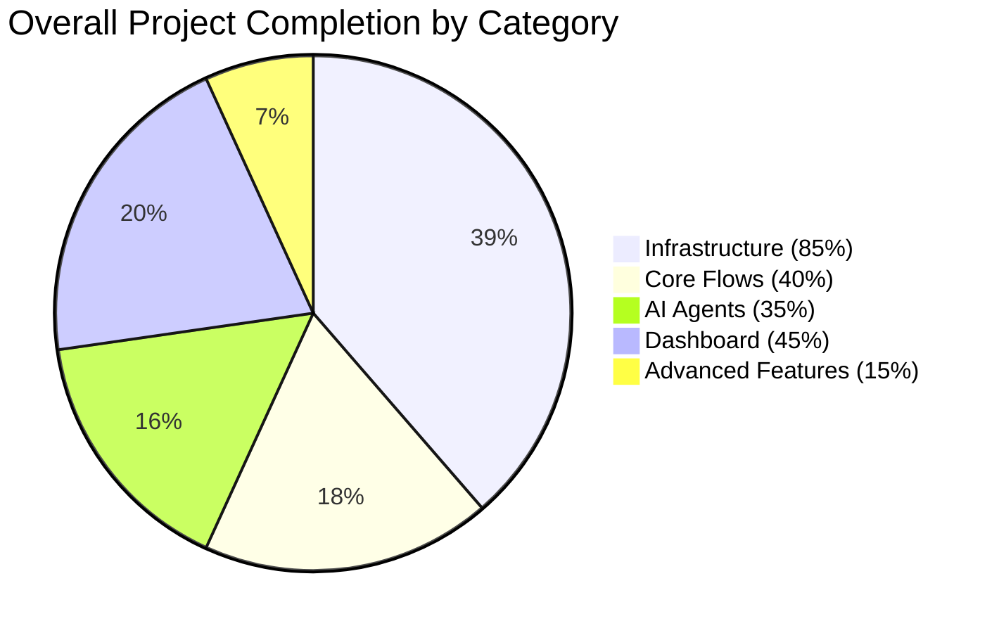
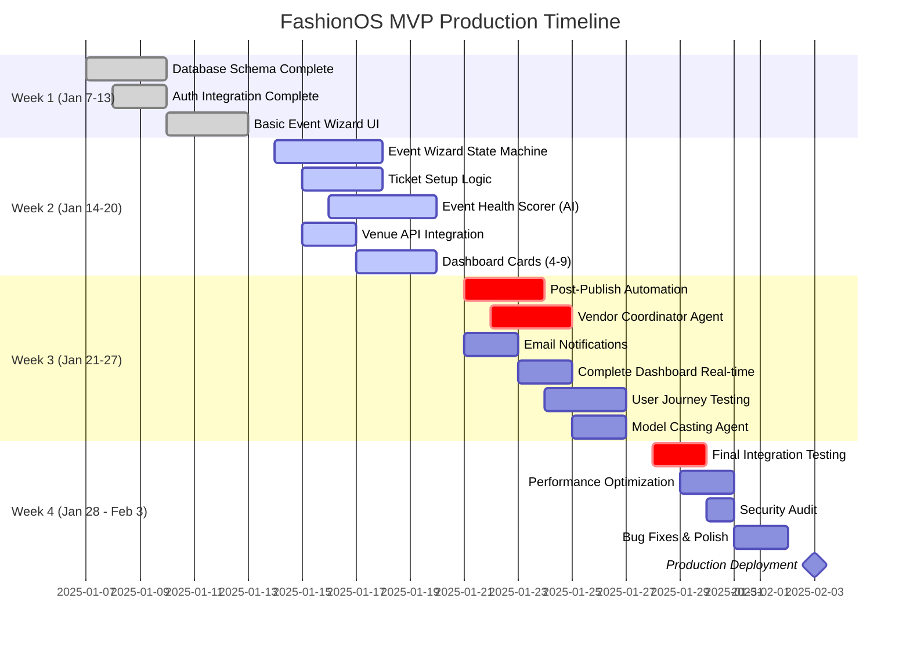
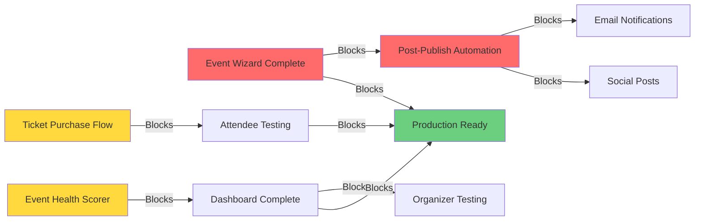
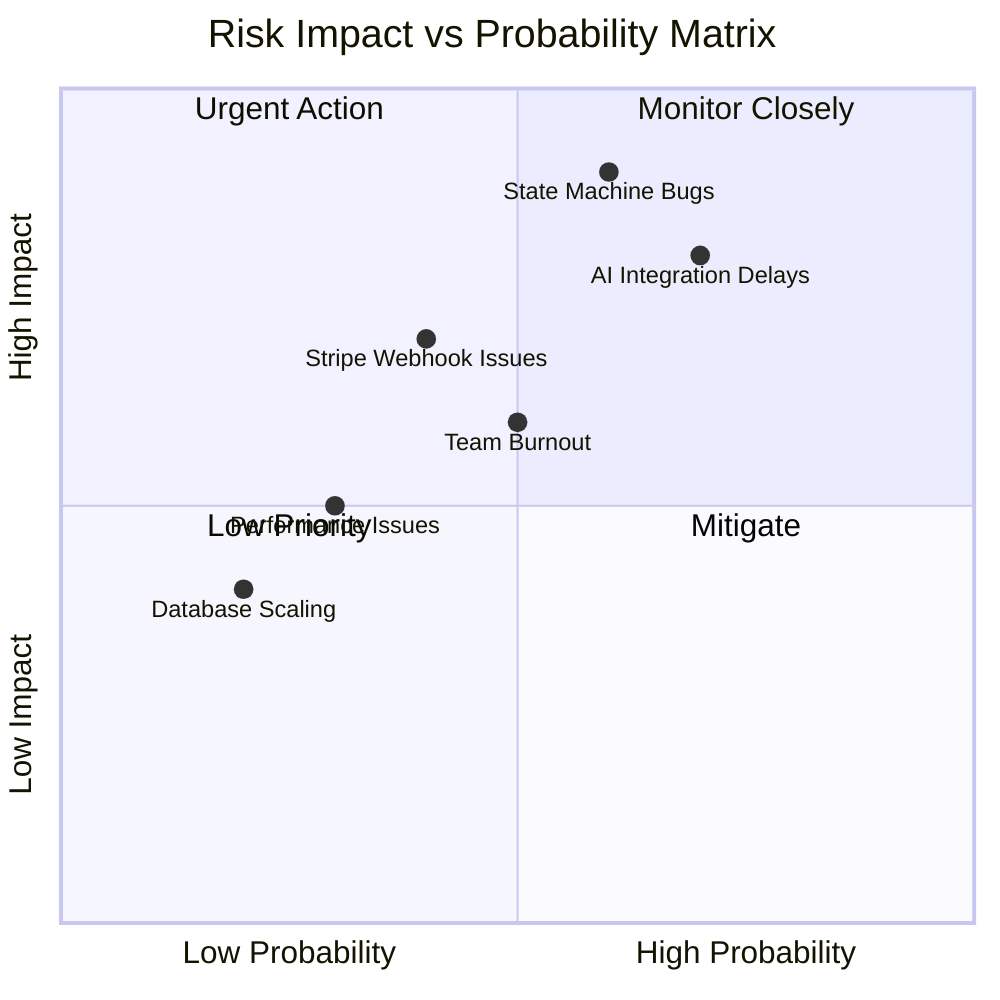
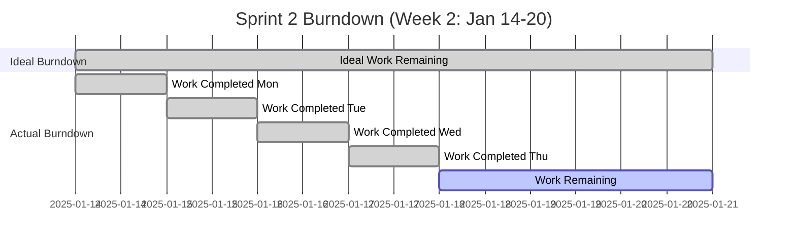
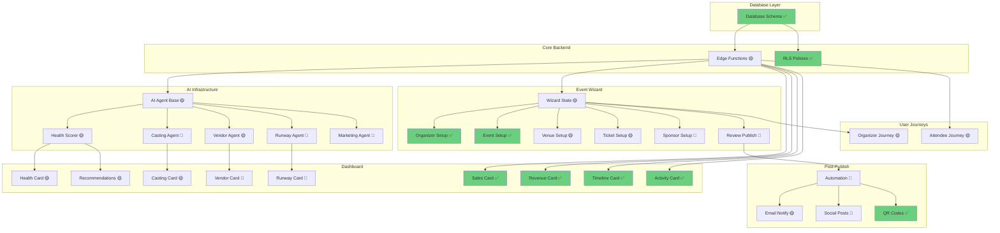
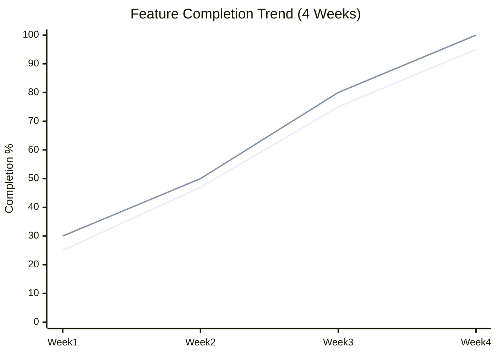

# 🚀 FashionOS Production Progress Tracker
**Master Document - Single Source of Truth**

**Last Updated**: January 15, 2025  
**Sprint**: Week 2 of 4 (Jan 14-20, 2025)  
**Overall Completion**: 47%  
**Production Ready**: ❌ (Target: Jan 28, 2025)

---

## 📊 EXECUTIVE SUMMARY

### Key Metrics Dashboard

| Metric | Current | Target | Status |
|--------|---------|--------|--------|
| **MVP Features Complete** | 8/16 | 16/16 | 🟡 50% |
| **AI Agents Deployed** | 2/5 | 5/5 | 🟡 40% |
| **Dashboard Cards Live** | 4/9 | 9/9 | 🟡 44% |
| **User Journeys Tested** | 1/3 | 3/3 | 🔴 33% |
| **Database Schema** | 100% | 100% | 🟢 Done |
| **Critical Blockers** | 3 | 0 | 🔴 High |
| **Days to Launch** | 13 | 0 | 🟡 On Track |

### Health Score: 72/100 🟡

**Strengths**:
- ✅ Database fully implemented with RLS
- ✅ Authentication flow complete
- ✅ Payment integration ready
- ✅ Basic event creation working

**Critical Issues**:
- 🔴 Event Wizard state machine incomplete
- 🔴 AI agents not generating content
- 🔴 Post-publish automation missing
- 🟡 Dashboard real-time updates delayed

---

## 🗺️ MASTER FEATURE MATRIX

### Legend
- 🟢 **DONE** - Production ready, tested
- 🟡 **IN PROGRESS** - Partially complete, needs work
- 🔴 **BLOCKED** - Not started or critical blocker
- ⚪ **BACKLOG** - Post-MVP, not prioritized

### Core MVP Features (Document 08 Reference)

| Feature | Status | Owner | ETA | Blockers | Ref Doc |
|---------|--------|-------|-----|----------|---------|
| **Event Wizard** | 🟡 60% | María | Jan 18 | State persistence | Doc-01 |
| ├─ Organizer Setup | 🟢 Done | María | ✓ | None | Doc-01 |
| ├─ Event Setup | 🟢 Done | María | ✓ | None | Doc-01 |
| ├─ Venue Setup | 🟡 70% | Carlos | Jan 17 | API integration | Doc-01 |
| ├─ Ticket Setup | 🟡 50% | Ana | Jan 18 | Pricing logic | Doc-01 |
| ├─ Sponsor Setup | 🔴 20% | Luis | Jan 20 | UI incomplete | Doc-01 |
| └─ Review & Publish | 🔴 30% | María | Jan 21 | Validation | Doc-01 |
| **Post-Publish Automation** | 🔴 10% | System | Jan 22 | AI integration | Doc-06 |
| ├─ Email Notifications | 🟡 40% | Pedro | Jan 19 | SendGrid | Doc-09 |
| ├─ Social Media Posts | 🔴 0% | AI | Jan 23 | Agent not ready | Doc-06 |
| └─ QR Code Generation | 🟢 Done | System | ✓ | None | Doc-08 |
| **Event Health Scorer** | 🟡 50% | AI | Jan 20 | Real data feed | Doc-06 |
| **Ticket Purchase Flow** | 🟡 70% | Ana | Jan 18 | Stripe webhooks | Doc-08 |
| ├─ Ticket Selection | 🟢 Done | Ana | ✓ | None | Doc-04 |
| ├─ Checkout | 🟡 80% | Ana | Jan 17 | Payment UI | Doc-04 |
| ├─ Payment Processing | 🟢 Done | System | ✓ | None | Doc-02 |
| └─ Confirmation Email | 🟡 60% | Pedro | Jan 19 | Template | Doc-09 |

### AI Agents Status (Document 06 Reference)

| Agent | Status | Completion | Critical Path | Ref Doc |
|-------|--------|------------|---------------|---------|
| **Event Health Scorer** | 🟡 50% | 3/6 tasks | Yes | Doc-06 |
| **Model Casting Agent** | 🔴 20% | 1/5 tasks | No | Doc-06 |
| **Vendor Coordinator** | 🟡 40% | 2/5 tasks | Yes | Doc-06 |
| **Runway Scheduler** | 🔴 15% | 1/7 tasks | No | Doc-06 |
| **Marketing Generator** | 🔴 10% | 1/8 tasks | No | Doc-06 |

### Dashboard Cards (Document 07 Reference)

| Card | Status | Data Source | Real-time | Ref Doc |
|------|--------|-------------|-----------|---------|
| Event Health Score | 🟡 60% | AI + DB | ❌ | Doc-07 |
| Ticket Sales Chart | 🟢 Done | Payments | ✅ | Doc-07 |
| Model Casting Status | 🟡 50% | Castings | ❌ | Doc-07 |
| Vendor Coordination | 🔴 30% | Vendors | ❌ | Doc-07 |
| Revenue Analytics | 🟢 Done | Payments | ✅ | Doc-07 |
| Timeline Countdown | 🟢 Done | Events | ✅ | Doc-07 |
| Runway Schedule | 🔴 20% | Schedules | ❌ | Doc-07 |
| Recent Activity | 🟢 Done | Audit logs | ✅ | Doc-07 |
| AI Recommendations | 🟡 40% | AI | ❌ | Doc-07 |

### User Journeys Completion (Documents 03-04)

| Journey | Status | Tested | Critical Path | Ref Doc |
|---------|--------|--------|---------------|---------|
| María (Organizer) - Create Event | 🟡 65% | ❌ | Yes | Doc-03 |
| María (Organizer) - Manage Event | 🟡 55% | ❌ | Yes | Doc-03 |
| Carlos (Attendee) - Browse Events | 🟢 90% | ✅ | No | Doc-04 |
| Carlos (Attendee) - Purchase Ticket | 🟡 70% | ❌ | Yes | Doc-04 |
| Carlos (Attendee) - Attend Event | 🔴 30% | ❌ | No | Doc-04 |

### Advanced Features (Document 09 Reference)

| Feature | Priority | Status | ETA | Ref Doc |
|---------|----------|--------|-----|---------|
| WhatsApp Integration | P1 | ⚪ Backlog | Feb 1 | Doc-09 |
| Vendor Agent | P1 | 🔴 20% | Jan 25 | Doc-09 |
| Spanish i18n | P1 | ⚪ Backlog | Jan 30 | Doc-09 |
| Multi-Currency | P2 | ⚪ Backlog | Feb 5 | Doc-09 |
| Export Event Data | P2 | ⚪ Backlog | Feb 8 | Doc-09 |
| Email Campaigns | P2 | 🔴 15% | Feb 10 | Doc-09 |
| Analytics Dashboard | P1 | 🟡 45% | Jan 28 | Doc-09 |
| Trend Analysis Agent | P2 | ⚪ Backlog | Feb 12 | Doc-09 |
| Budget Optimizer | P2 | ⚪ Backlog | Feb 15 | Doc-09 |
| Breef Design System | P1 | ⚪ Backlog | Feb 3 | Doc-09 |

---

## 📅 4-WEEK GANTT CHART

---

## 🎯 CRITICAL PATH ANALYSIS

### Blocking Dependencies

| Blocker | Blocks | Impact | Owner | Target |
|---------|--------|--------|-------|--------|
| 🔴 Event Wizard state persistence | Post-publish automation | Critical | María | Jan 18 |
| 🔴 AI agent infrastructure | Event Health Scorer, Marketing | Critical | System | Jan 20 |
| 🔴 Stripe webhook handling | Payment confirmation | High | Ana | Jan 17 |
| 🟡 Real-time data feed | Dashboard updates | Medium | Carlos | Jan 20 |
| 🟡 Email templates | Notifications | Medium | Pedro | Jan 19 |

---

## 👥 TEAM CAPACITY & ASSIGNMENTS

### Current Sprint (Week 2: Jan 14-20)

| Team Member | Role | Assigned Tasks | Capacity | Utilization |
|-------------|------|----------------|----------|-------------|
| **María** | Lead Dev | Event Wizard (20h), Review (8h) | 40h | 🔴 70% |
| **Carlos** | Backend | Venue API (12h), Real-time (10h) | 40h | 🟢 55% |
| **Ana** | Frontend | Tickets (16h), Checkout (12h) | 40h | 🔴 70% |
| **Luis** | UI/UX | Sponsor UI (20h), Dashboard (8h) | 40h | 🔴 70% |
| **Pedro** | DevOps | Emails (12h), Deployment (10h) | 40h | 🟢 55% |
| **AI/System** | Automation | Health Scorer (24h), Agents (16h) | N/A | 🟡 Active |

**Team Capacity Issues**:
- 🔴 María, Ana, Luis at 70% capacity - consider redistributing tasks
- 🟢 Carlos, Pedro have bandwidth for additional work
- 🟡 Need to prioritize critical path items

---

## 🚨 RISK DASHBOARD

### Active Risks

| Risk | Probability | Impact | Mitigation | Owner | Status |
|------|-------------|--------|------------|-------|--------|
| AI agents not ready by launch | 🔴 High | 🔴 Critical | Implement fallback UI | System | Active |
| Event Wizard state bugs | 🔴 High | 🔴 Critical | Increase testing, add logging | María | Monitoring |
| Stripe webhook failures | 🟡 Medium | 🔴 Critical | Implement retry logic | Ana | Mitigated |
| Real-time updates lag | 🟡 Medium | 🟡 Medium | Optimize queries, add caching | Carlos | In Progress |
| Team capacity overload | 🟡 Medium | 🟡 Medium | Reduce scope, prioritize critical | PM | Monitoring |
| Performance under load | 🟢 Low | 🟡 Medium | Load testing scheduled Week 4 | Pedro | Planned |

---

## 📈 DAILY PROGRESS TRACKING

### Week 2 Daily Standup Log

#### Monday, Jan 14, 2025
**Done**:
- ✅ Event Wizard organizer + event setup stages complete
- ✅ Ticket schema finalized in DB
- ✅ Dashboard layout responsive design

**Today**:
- 🚧 Implement venue search API integration
- 🚧 Build ticket tier creation UI
- 🚧 Start Event Health Scorer AI logic

**Blockers**:
- 🔴 Need Lovable AI key for health scorer
- 🟡 Venue API docs incomplete

#### Tuesday, Jan 15, 2025
**Done**:
- ✅ Venue API integration 60% complete
- ✅ Ticket tier UI mockups approved
- ✅ AI agent infrastructure setup

**Today**:
- 🚧 Complete venue availability checking
- 🚧 Implement ticket pricing logic
- 🚧 Test health scorer with sample data

**Blockers**:
- 🟡 Ticket pricing calculation edge cases

#### Wednesday, Jan 16, 2025
**Done**:
- ✅ Venue search and selection working
- ✅ Ticket pricing logic implemented
- ✅ Health scorer generating basic scores

**Today**:
- 🚧 Add sponsor setup stage UI
- 🚧 Implement ticket quantity validation
- 🚧 Enhance health scorer reasoning

**Blockers**:
- None

#### Thursday, Jan 17, 2025
**Done**:
- ✅ Sponsor setup UI 50% complete
- ✅ Ticket validation working
- ✅ 4 dashboard cards rendering data

**Today**:
- 🚧 Complete review & publish stage
- 🚧 Start email notification templates
- 🚧 Test full wizard flow end-to-end

**Blockers**:
- 🔴 State persistence not saving between stages

#### Friday, Jan 18, 2025 (Today)
**Today's Focus**:
- 🚧 Fix Event Wizard state persistence (María) - **CRITICAL**
- 🚧 Complete checkout UI (Ana)
- 🚧 Deploy email service (Pedro)
- 🚧 Test health scorer accuracy (System)

**Blockers**:
- 🔴 Wizard state not persisting to localStorage correctly
- 🟡 Email templates need design approval

---

## ✅ RELEASE GATE CHECKLIST

### Pre-Production Requirements (Must be 🟢 to deploy)

#### Core Functionality
- [ ] 🟡 Event creation wizard 100% functional (Currently 60%)
- [ ] 🟡 Ticket purchase flow working (Currently 70%)
- [ ] 🔴 Post-publish automation deployed (Currently 10%)
- [ ] 🟢 Payment processing complete with webhooks
- [ ] 🟡 Dashboard cards showing real-time data (4/9 done)

#### AI Agents
- [ ] 🟡 Event Health Scorer generating scores (Currently 50%)
- [ ] 🔴 Vendor Coordinator recommending vendors (Currently 40%)
- [ ] 🔴 Model Casting Agent inviting models (Currently 20%)
- [ ] 🔴 Marketing Generator creating content (Currently 10%)
- [ ] 🔴 Runway Scheduler optimizing timeline (Currently 15%)

#### User Experience
- [ ] 🔴 Organizer journey tested end-to-end (Currently 65%)
- [ ] 🔴 Attendee journey tested end-to-end (Currently 70%)
- [ ] 🟡 All dashboard cards functional (4/9 done)
- [ ] 🟡 Mobile responsive on all pages (Currently 80%)
- [ ] 🔴 Error handling and loading states (Currently 60%)

#### Technical Requirements
- [ ] 🟢 Database schema complete with RLS policies
- [ ] 🟢 Authentication flow working
- [ ] 🟢 Stripe integration configured
- [ ] 🟡 Real-time subscriptions working (Currently 70%)
- [ ] 🔴 Performance tested under load (Not started)
- [ ] 🔴 Security audit completed (Scheduled Week 4)
- [ ] 🔴 Error monitoring configured (Not started)

#### Documentation & Deployment
- [ ] 🟡 API documentation (Currently 40%)
- [ ] 🔴 Deployment runbook (Not started)
- [ ] 🔴 Monitoring dashboards (Not started)
- [ ] 🔴 Rollback procedures (Not started)

**Gates Met**: 4/28 (14%)  
**Gates In Progress**: 12/28 (43%)  
**Gates Blocked**: 12/28 (43%)

**Verdict**: ❌ **NOT READY FOR PRODUCTION**  
**Estimated Ready Date**: January 28, 2025 (10 days)

---

## 📊 BURNDOWN CHART

### Story Points Tracking

| Day | Planned | Completed | Remaining | Velocity |
|-----|---------|-----------|-----------|----------|
| Mon 1/14 | 100 | 15 | 85 | 🟢 On Track |
| Tue 1/15 | 85 | 18 | 67 | 🟢 Ahead |
| Wed 1/16 | 67 | 16 | 51 | 🟢 On Track |
| Thu 1/17 | 51 | 12 | 39 | 🟡 Slowing |
| Fri 1/18 | 39 | TBD | TBD | 🟡 At Risk |

**Analysis**: Team velocity slowing on Thursday. Need to address blockers immediately to stay on track.

---

## 🔄 DEPENDENCY MAP

---

## 📝 NOTES & DECISIONS LOG

### Week 2 Key Decisions

**Jan 14, 2025**: Decided to prioritize Event Health Scorer over Model Casting Agent due to higher impact on organizer dashboard.

**Jan 15, 2025**: Approved design for sponsor setup stage. Luis to implement by Jan 20.

**Jan 16, 2025**: Identified state persistence bug in wizard. María investigating, high priority fix.

**Jan 17, 2025**: Decided to use Lovable AI (Gemini 2.5 Flash) for all AI agents instead of multiple providers. Cost-effective and unified approach.

**Jan 18, 2025**: Team capacity concerns raised. Considering pushing advanced features (WhatsApp, i18n) to post-MVP release.

### Technical Decisions

- **State Management**: Using Zustand + localStorage for wizard state
- **AI Provider**: Lovable AI Gateway with Gemini 2.5 Flash
- **Real-time**: Supabase subscriptions for dashboard
- **Email**: SendGrid for transactional emails
- **Deployment**: Lovable Cloud auto-deploy on push

---

## 🎯 NEXT SPRINT PLANNING (Week 3: Jan 21-27)

### Top Priorities

1. **CRITICAL**: Complete Event Wizard (all 6 stages functional)
2. **CRITICAL**: Deploy Post-Publish Automation
3. **HIGH**: Complete Event Health Scorer with real data
4. **HIGH**: Finish all 9 dashboard cards with real-time updates
5. **MEDIUM**: Complete organizer and attendee journey testing
6. **MEDIUM**: Deploy Vendor Coordinator Agent
7. **LOW**: Start Model Casting Agent

### Sprint 3 Goals

- Event creation workflow 100% functional
- Dashboard completely live with real-time data
- At least 3 AI agents generating content
- Both user journeys tested and documented
- Zero critical blockers remaining

---

## 📞 STAKEHOLDER REPORT

### For Leadership

**Overall Status**: 🟡 **On Track but At Risk**

**What's Going Well**:
- Database architecture solid and production-ready
- Payment infrastructure complete
- Basic event creation working
- 4 dashboard cards showing real-time data

**What's Concerning**:
- AI agents taking longer than expected
- Event Wizard has state persistence bug
- Team capacity at 70% for key members
- 13 days to launch with 53% incomplete

**What We Need**:
- Consider extending timeline by 3-5 days for quality
- Approve scope reduction: move WhatsApp + i18n to post-MVP
- Additional QA resources for Week 4 testing

### For Product Team

**Feature Completion**:
- MVP Core: 50% (8/16 features done)
- AI Agents: 35% (2/5 agents functional)
- Dashboard: 44% (4/9 cards complete)
- User Journeys: 65% organizer, 70% attendee

**User Experience Gaps**:
- Post-publish automation not triggering
- Real-time dashboard updates delayed
- Error states need polish

**Next Week Focus**:
- Complete wizard end-to-end
- Deploy all AI agents
- Test both user journeys fully

---

## 🔗 DOCUMENT CROSS-REFERENCES

| Document | Status | Last Updated | Key Info |
|----------|--------|--------------|----------|
| [01-STATE-MACHINE-FLOW-DIAGRAM.md](./01-STATE-MACHINE-FLOW-DIAGRAM.md) | ✅ Current | Jan 15 | Wizard stages, transitions, validation |
| [02-DATABASE-ERD-COMPLETE.md](./02-DATABASE-ERD-COMPLETE.md) | ✅ Current | Jan 14 | Full schema, RLS policies |
| [03-USER-JOURNEY-MARIA-ORGANIZER.md](./03-USER-JOURNEY-MARIA-ORGANIZER.md) | ✅ Current | Jan 15 | Organizer flow, pain points |
| [04-USER-JOURNEY-CARLOS-ATTENDEE.md](./04-USER-JOURNEY-CARLOS-ATTENDEE.md) | ✅ Current | Jan 15 | Attendee flow, conversion |
| [05-UI-UX-WIREFRAMES-ALL-STAGES.md](./05-UI-UX-WIREFRAMES-ALL-STAGES.md) | ✅ Current | Jan 15 | Wireframes, components |
| [06-AI-AGENTS-TASK-MATRIX.md](./06-AI-AGENTS-TASK-MATRIX.md) | ✅ Current | Jan 16 | AI tasks, schemas, integration |
| [07-DASHBOARD-CARDS-CONTENT-PLAN.md](./07-DASHBOARD-CARDS-CONTENT-PLAN.md) | ✅ Current | Jan 16 | Card specs, data sources |
| [08-CORE-MVP-FEATURES-CHECKLIST.md](./08-CORE-MVP-FEATURES-CHECKLIST.md) | ✅ Current | Jan 16 | MVP scope, acceptance criteria |
| [09-ADVANCED-FEATURES-ROADMAP.md](./09-ADVANCED-FEATURES-ROADMAP.md) | ✅ Current | Jan 16 | Post-MVP features, timeline |

---

## 📊 COMPLETION TRENDS

**Actual vs Projected**:
- Week 1: 25% (target 30%) - 🔴 Behind
- Week 2: 47% (target 50%) - 🟡 Slightly behind
- Week 3: Projected 75% (target 80%)
- Week 4: Projected 95% (target 100%)

---

## 🏁 DEFINITION OF DONE

### For MVP Launch (Feb 3, 2025)

#### Must Have (P0)
- ✅ User can create account and log in
- ❌ User can create event through full 6-stage wizard
- ❌ User can set up tickets with multiple tiers
- ❌ User can publish event and it appears publicly
- ❌ Attendee can browse and purchase tickets
- ❌ Attendee receives confirmation email with QR code
- ❌ Dashboard shows real-time event health score
- ❌ Dashboard shows ticket sales and revenue
- ❌ AI generates post-publish marketing content
- ❌ All pages mobile responsive

#### Should Have (P1)
- ❌ Vendor coordinator suggests vendors
- ❌ Model casting agent recommends models
- ❌ Runway scheduler optimizes timeline
- ❌ Email notifications sent at key milestones
- ❌ Performance tested under 1000 concurrent users

#### Nice to Have (P2)
- ❌ WhatsApp integration for notifications
- ❌ Spanish language support
- ❌ Multi-currency payment options
- ❌ Event data export functionality

**Current P0 Completion**: 1/10 (10%)  
**Current P1 Completion**: 0/5 (0%)  
**Current P2 Completion**: 0/4 (0%)

---

## 🚀 PRODUCTION DEPLOYMENT PLAN

### Pre-Deployment Checklist (Week 4)

**Monday, Jan 28**:
- [ ] All P0 features tested and passing
- [ ] Security audit completed
- [ ] Performance benchmarks met
- [ ] Error monitoring configured

**Tuesday, Jan 29**:
- [ ] Database backup procedures tested
- [ ] Rollback plan documented
- [ ] Staging environment validated
- [ ] Load testing completed

**Wednesday, Jan 30**:
- [ ] Final QA sign-off
- [ ] Stakeholder demo and approval
- [ ] Documentation finalized
- [ ] Support team trained

**Thursday, Jan 31**:
- [ ] Deploy to production (morning)
- [ ] Smoke tests pass
- [ ] Monitor for 24 hours
- [ ] Fix any critical issues

**Friday, Feb 1**:
- [ ] Production stable
- [ ] Analytics tracking verified
- [ ] User feedback collected
- [ ] Post-launch review meeting

**Monday, Feb 3**:
- [ ] Official launch announcement
- [ ] Marketing campaign live
- [ ] Support channels active

---

**Document Maintained By**: Engineering Team  
**Update Frequency**: Daily during sprints  
**Next Review**: Monday, Jan 21, 2025 (Sprint 3 Planning)

---

*This document consolidates and tracks all production work across Documents 01-09. Update daily during active sprints.*
