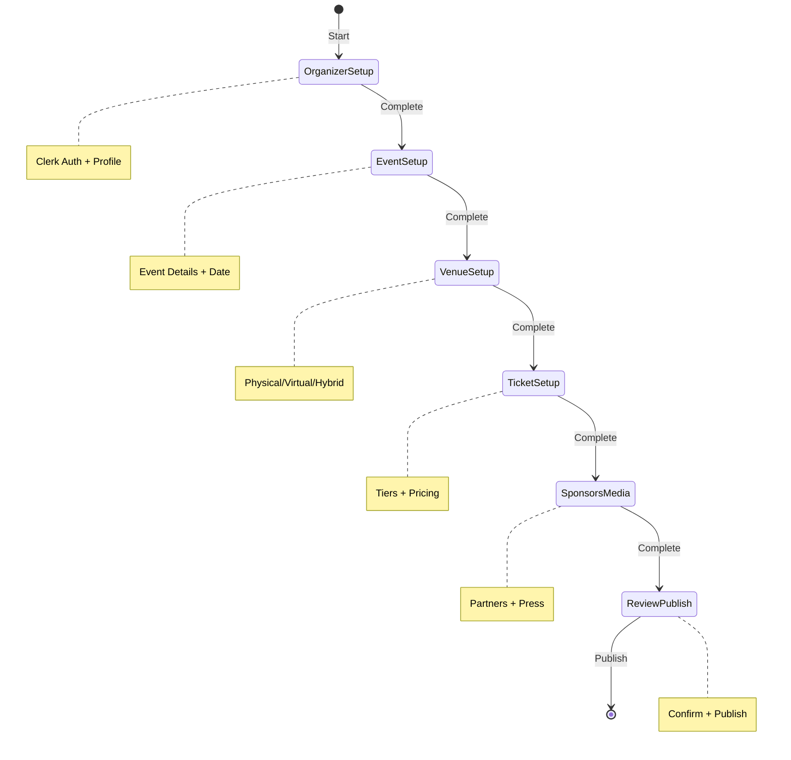

# Event Wizard - CopilotKit State Machine Implementation Plan

## Architecture Overview

This implementation follows the CopilotKit state machine pattern as demonstrated in their official car sales example. The Event Wizard will guide users through 6 distinct stages to create fashion events.

## Key Principles (from CopilotKit docs)

1. **Single State Source**: One React state manages the entire wizard
2. **Stage Isolation**: Each stage has its own hook with scoped instructions/actions
3. **Available Prop**: Controls when AI features are active per stage  
4. **Deterministic Transitions**: Clear rules for moving between stages
5. **LLM-Driven Actions**: AI can trigger stage transitions based on context

## Project Structure

```
/event-wizard/
├── /src/
│   ├── /hooks/
│   │   ├── use-global-state.tsx       # Central state management
│   │   └── /stages/
│   │       ├── use-stage-organizer.tsx
│   │       ├── use-stage-event.tsx
│   │       ├── use-stage-venue.tsx
│   │       ├── use-stage-tickets.tsx
│   │       ├── use-stage-sponsors.tsx
│   │       └── use-stage-review.tsx
│   ├── /components/
│   │   ├── event-wizard-chat.tsx      # Main chat interface
│   │   ├── state-visualizer.tsx       # Visual state machine
│   │   └── /forms/
│   │       ├── organizer-form.tsx
│   │       ├── event-form.tsx
│   │       ├── venue-form.tsx
│   │       ├── tickets-form.tsx
│   │       ├── sponsors-form.tsx
│   │       └── review-form.tsx
│   ├── /lib/
│   │   ├── /supabase/
│   │   │   ├── client.ts
│   │   │   └── functions.ts
│   │   ├── /validation/
│   │   │   └── schemas.ts
│   │   └── /clerk/
│   │       └── config.ts
│   └── /types/
│       └── wizard.ts
├── /supabase/
│   ├── /migrations/
│   │   ├── 001_wizard_tables.sql
│   │   ├── 002_rpc_functions.sql
│   │   └── 003_rls_policies.sql
│   └── /functions/
│       └── wizard-session/
│           └── index.ts
└── README.md
```

## State Machine Flow



## Implementation Timeline

### Phase 1: Core Setup (Day 1)
- Database migrations with RPC functions
- Clerk authentication setup
- Supabase Edge Functions
- Base project structure

### Phase 2: State Machine (Day 2)  
- Global state hook
- All 6 stage hooks
- Stage transitions
- Progress tracking

### Phase 3: UI Components (Day 3)
- Chat interface
- Form components
- State visualizer
- Mobile responsive

### Phase 4: AI Integration (Day 4)
- CopilotKit configuration
- Stage-specific instructions
- Validation with Zod
- Error handling

### Phase 5: Testing & Deploy (Day 5)
- End-to-end testing
- Security audit
- Production deployment
- Monitoring setup